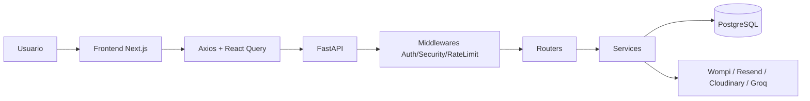

# Revital E-commerce

Plataforma de e-commerce compuesta por **frontend (Next.js)** y **backend (FastAPI)** para gestionar catálogo, carrito, checkout, pedidos, autenticación por roles y panel administrativo.

## 📌 Descripción

Revital E-commerce permite operar una tienda online completa con:

- Catálogo de productos con filtros y búsqueda
- Carrito y checkout
- Gestión de pedidos
- Autenticación JWT con roles (`admin`, `employee`, `customer`)
- Panel administrativo (productos, categorías, marcas, proveedores, descuentos, analytics)
- Integraciones de pago, email, media y AI administrativa

## 🛠️ Tecnologías

### Frontend
- Next.js 16
- React 19
- TypeScript
- Tailwind CSS
- Radix UI / shadcn-style components
- React Query
- React Hook Form + Zod
- Axios
- Zustand

### Backend
- FastAPI
- SQLAlchemy
- Pydantic v2
- PostgreSQL
- JWT (PyJWT)
- SlowAPI (rate limit)

### Integraciones
- Wompi (pagos)
- Resend (emails)
- Cloudinary (imágenes)
- Groq (asistente AI admin)

## 📂 Estructura del proyecto

```txt
revital_ecommerce/
├── frontend/                # App Next.js (shop, auth, admin)
│   ├── app/                 # Rutas App Router
│   ├── components/          # Componentes UI y de negocio
│   ├── hooks/               # Hooks de datos y estado
│   ├── services/            # Servicios HTTP por dominio
│   ├── stores/              # Estado global (Zustand)
│   └── utils/               # API wrapper y utilidades
│
├── backend/                 # API FastAPI
│   ├── app/
│   │   ├── core/            # Configuración, DB, seguridad base
│   │   ├── middlewares/     # Auth/security middlewares
│   │   ├── routers/         # Endpoints HTTP
│   │   ├── services/        # Lógica de negocio
│   │   ├── schemas/         # DTOs/validaciones Pydantic
│   │   └── templates/       # Templates de email
│   └── tests/               # Tests backend
│
└── docs/                    # Documentación funcional/técnica
```

## ⚙️ Instalación y configuración

## Requisitos
- Node.js 18+
- pnpm
- Python 3.11+ (ideal: 3.13)
- PostgreSQL

## 1) Backend

```bash
cd revital_ecommerce/backend
python3 -m venv venv
source venv/bin/activate
pip install -r requirements.txt
```

Configura variables de entorno:

```bash
cp .env.example .env
cp .env.development.example .env.development
```

Ejecuta API:

```bash
fastapi dev app/main.py --host 0.0.0.0 --port 8000
```

## 2) Frontend

```bash
cd revital_ecommerce/frontend
pnpm install
```

Configura variables:

```bash
cp .env.development.example .env.development
```

Ejecuta app:

```bash
pnpm dev
```

Frontend en: `http://localhost:3001`  
Backend en: `http://localhost:8000`

## 🚀 Uso

### Flujo principal
1. Usuario navega catálogo y agrega productos al carrito
2. Checkout crea/consulta orden y procesa pago
3. Backend valida auth/roles y ejecuta lógica de negocio
4. Panel admin gestiona entidades y consulta analytics

### Endpoints principales (backend)

- `POST /api/login`
- `POST /api/refresh`
- `GET /api/auth/me`
- `GET /api/products`
- `GET /api/products-admin`
- `POST /api/order`
- `GET /api/orders`
- `GET /api/admin/dashboard`
- `GET /api/admin/analytics`
- `POST /api/admin/ai/chat`

Documentación OpenAPI (dev):
- `http://localhost:8000/docs`
- `http://localhost:8000/redoc`

## 🔐 Variables de entorno

## Frontend (`frontend/.env.development`)
- `NEXT_PUBLIC_API_URL`: URL base del backend (ej: `http://localhost:8000/api`)
- `NEXT_PUBLIC_WOMPI_PUBLIC_KEY`: llave pública de Wompi
- `NEXT_PUBLIC_WOMPI_INTEGRITY_SECRET`: integridad de widget Wompi (si aplica)
- `NEXT_PUBLIC_BACKEND_URL`: fallback para rutas API internas de pagos

## Backend (`backend/.env*`)
- `ENVIRONMENT`: `development` o `production`
- `DATABASE_URL`: conexión PostgreSQL
- `SECRET_KEY`, `ALGORITHM`: firma de JWT
- `ACCESS_TOKEN_EXPIRE_MINUTES`, `REFRESH_TOKEN_EXPIRE_DAYS`
- `FRONTEND_URL`, `VERIFY_EMAIL_URL`, `RESET_PASSWORD_URL`
- `RESEND_API_KEY`, `RESEND_FROM_EMAIL`, `RESEND_FROM_NAME`
- `WOMPI_PUBLIC_KEY`, `WOMPI_PRIVATE_KEY`, `WOMPI_EVENTS_SECRET`, `WOMPI_INTEGRITY_SECRET`
- `CLOUDINARY_CLOUD_NAME`, `CLOUDINARY_API_KEY`, `CLOUDINARY_API_SECRET`
- `GROQ_API_KEY`
- `TURNSTILE_SECRET_KEY`, `TURNSTILE_ENABLED`

## 🧪 Testing

Actualmente hay tests de backend en `revital_ecommerce/backend/tests`.

Ejecutar:

```bash
cd revital_ecommerce/backend
source venv/bin/activate
pytest -q
```

## 📦 Scripts disponibles

## Frontend (`frontend/package.json`)
- `pnpm dev` -> entorno local
- `pnpm build` -> build producción
- `pnpm start` -> run de build
- `pnpm lint` -> lint Next.js
- `pnpm verify-api` -> verificación de conexión API

## Backend
- `fastapi dev app/main.py --host 0.0.0.0 --port 8000` -> desarrollo
- `python3 -m uvicorn app.main:app --reload --host 0.0.0.0 --port 8000` -> alternativa

## 🧠 Decisiones técnicas

- **FastAPI + SQLAlchemy + Pydantic** para una API tipada, validada y mantenible.
- **React Query** para estado de servidor con caché, retries y sincronización.
- **Axios wrapper central** para auth token, refresh y manejo unificado de errores.
- **Middleware de seguridad/autenticación** para control transversal de acceso y headers.
- **Arquitectura por capas** (`router -> service -> db`) para separar transporte de negocio.

## 🏗️ Arquitectura (vista rápida)



## 📄 Licencia

Definir según política del proyecto (privada o open-source).
