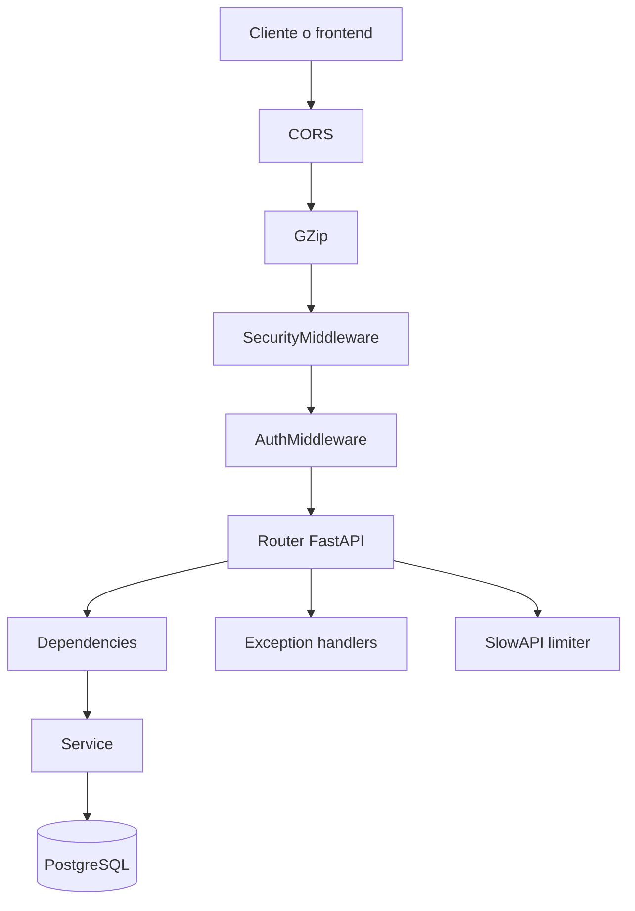

# Backend Technical Overview

## Objetivo
Este documento describe tecnicamente el backend de `revital_ecommerce`, carpeta por carpeta y archivo por archivo, para que cualquier desarrollador pueda entender rapidamente como esta organizado, que responsabilidad tiene cada modulo y como se conectan entre si.

## Contexto arquitectonico
`revital_ecommerce/backend` implementa una API FastAPI para una instancia aislada del ecommerce. La organizacion general sigue una separacion por capas:

- `routers/`: expone endpoints HTTP y valida acceso.
- `services/`: concentra la logica de negocio.
- `schemas/`: define contratos Pydantic para entrada/salida.
- `core/`: configuracion, JWT, dependencias, DB y utilidades compartidas.
- `middlewares/`: validaciones transversales y seguridad.
- `templates/`: plantillas HTML de email.

Una caracteristica importante de este backend es que **no tiene una carpeta `models/` activa** con entidades ORM del dominio. Aunque `app/core/database.py` define `Base = declarative_base()`, la mayor parte del acceso a datos ocurre con `Session`, SQL directo (`text()`), funciones SQL y tablas/vistas almacenadas en PostgreSQL.

## Flujo general de una request

## Mapa de la raiz del backend

### Carpetas principales
- `app/`: codigo fuente principal de la API.
- `docs/`: documentacion tecnica adicional, incluida la del subsistema de IA y este documento.
- `scripts/`: scripts utilitarios y migraciones manuales orientadas a base de datos o diagnostico.
- `tests/`: pruebas automatizadas con pytest.
- `venv/`: entorno virtual local con dependencias instaladas. No forma parte del codigo de negocio ni conviene documentarlo archivo por archivo.

### Archivos de raiz
- `.env`: configuracion local real de la instancia. Contiene secretos/runtime config y no debe usarse como documentacion.
- `.env.example`: plantilla base de variables de entorno compartidas.
- `.env.development.example`: ejemplo de configuracion para desarrollo.
- `.env.production.example`: ejemplo de configuracion para produccion.
- `.gitignore`: exclusiones de Git para artefactos locales, cache y entorno virtual.
- `README.md`: documentacion general del backend, stack, setup, arquitectura SaaS aislada y convenciones de trabajo.
- `requirements.txt`: dependencias Python del backend. Incluye FastAPI, SQLAlchemy, Pydantic, PyJWT, `pwdlib`, `resend`, `cloudinary`, `httpx`, `groq`, `slowapi` y librerias auxiliares.

## `app/`
`app/` contiene toda la aplicacion FastAPI. La entrada principal es `app/main.py` y desde ahi se registra el resto del sistema.

### `app/main.py`
- Crea la instancia `FastAPI` con `docs_url`, `redoc_url` y `openapi_url` deshabilitados en produccion.
- Define `ALLOWED_CORS_ORIGINS` para frontend local y dominio productivo.
- Registra handlers globales para `RateLimitExceeded`, `StarletteHTTPException`, `SQLAlchemyError` y excepciones genericas, devolviendo mensajes sanitizados.
- Agrega `TrustedHostMiddleware` en produccion, `GZipMiddleware`, `SecurityMiddleware` y `AuthMiddleware`.
- Monta todos los routers usando el prefijo global `settings.API_STR`.
- Contiene el endpoint raiz `GET /` limitado por `SlowAPI`.
- Ordena routers delicados como `dashboard_router` y `analytics_router` antes de `order_router` para evitar colisiones de rutas admin dinamicas.

## `app/core/`
Contiene la infraestructura compartida: configuracion, acceso a DB, JWT, dependencias FastAPI y utilidades de seguridad.

### `app/core/config.py`
- Define `Settings` con `BaseSettings`.
- Carga `.env` y luego `.env.development` o `.env.production` segun `ENVIRONMENT`.
- Centraliza configuracion de base de datos, JWT, Cloudinary, Resend, Wompi, URLs frontend y metadatos de la tienda.
- Expone `settings` y la funcion `is_production()` para condicionar comportamiento sensible.

### `app/core/database.py`
- Configura el `engine` SQLAlchemy usando `settings.DATABASE_URL`.
- Crea `SessionLocal` para dependencias request-scoped.
- Define `Base = declarative_base()`, aunque el proyecto no usa de forma visible una capa ORM de modelos de negocio.
- Expone `get_db()` como generador usado por `Depends`.

### `app/core/dependencies.py`
- Implementa dependencias reutilizables de autenticacion/autorizacion.
- `get_current_user()` resuelve el usuario autenticado usando token Bearer y `auth_service`.
- `get_current_user_optional()` permite rutas que aceptan sesion opcional.
- `require_role()`, `require_admin()` y `require_user_or_admin()` encapsulan reglas de acceso frecuentes.

### `app/core/exceptions.py`
- Define mensajes seguros de error (`MSG_GENERIC_ERROR`, `MSG_DATABASE_ERROR`, etc.).
- Detecta excepciones ligadas a DB/SQL para no filtrar detalles internos.
- `get_safe_message()` garantiza respuestas user-facing seguras.

### `app/core/jwt_utils.py`
- Crea y valida tokens JWT de acceso y refresh.
- Hash y verificacion de contrasenas con Argon2 via `pwdlib.PasswordHash.recommended()`.
- Incluye helpers para token de verificacion de email y reset de contrasena.
- Es la base criptografica usada por `auth_service`.

### `app/core/otp_store.py`
- Implementa un almacen en memoria para OTP de verificacion de email.
- Usa un diccionario `_store` con expiracion por tiempo.
- Expone `set_otp()`, `verify_otp()` y `get_otp_expires_minutes()`.
- Es util para desarrollo y flujos simples; en despliegues mas robustos podria migrarse a Redis.

### `app/core/rate_limiter.py`
- Crea la instancia global `limiter = Limiter(key_func=get_client_ip)`.
- `get_client_ip()` prioriza `X-Forwarded-For`, luego `X-Real-IP`, y finalmente `request.client.host`.
- Permite rate limiting correcto detras de proxies o balanceadores.

### `app/core/tenant.py`
- Modela la configuracion de Wompi por tienda con `StoreWompiConfig`.
- `get_store_from_request()` intenta identificar tenant/store desde `x-store-id`, host o fallback global.
- Aunque el repo sigue una arquitectura de instancias aisladas, este modulo deja preparado un camino para multi-store en pagos.
- `get_wompi_base_url()` abstrae la URL base segun ambiente Wompi.

### `app/core/token_blacklist.py`
- Implementa blacklist en memoria para invalidar JWT.
- Expone `add_token_to_blacklist()`, `is_token_blacklisted()`, `cleanup_expired_tokens()` y `get_blacklist_size()`.
- El propio archivo documenta que en produccion convendria usar Redis o almacenamiento con TTL real.

## `app/middlewares/`
Middlewares HTTP personalizados que interceptan request/response antes de llegar a routers o al volver al cliente.

### `app/middlewares/auth_middleware.py`
- Define `AuthMiddleware`, usado por `main.py` para proteger rutas segun `protected_paths` y `admin_only_paths`.
- Gestiona excepciones funcionales: `OPTIONS`, registro publico de usuarios, rutas de carrito anonimo y `GET /api/top-info-bar/active`.
- Usa `auth_service` y `get_db()` para validar tokens y roles durante el pipeline HTTP.
- Tambien contiene `ProductMiddleware`, que parece accesorio o menos central que `AuthMiddleware`.

### `app/middlewares/role_middleware.py`
- Contiene una implementacion alternativa/mas extensa de control de roles.
- Define `RoleBasedAccessMiddleware`, `SmartAuthMiddleware` y un helper `require_role()`.
- Funciona como logica de autorizacion mas granular/legacy que la solucion activa principal basada en `AuthMiddleware` + dependencies.

### `app/middlewares/security_middleware.py`
- Implementa `SecurityMiddleware`.
- Valida `Content-Type`, tamano de body y patrones comunes de XSS antes/despues del procesamiento.
- Agrega headers como `X-Frame-Options`, `X-Content-Type-Options`, `Referrer-Policy`, `Permissions-Policy` y CSP adaptable a entorno/documentacion.

## `app/routers/`
Cada router encapsula un conjunto de endpoints relacionados por dominio funcional. En general delegan la logica a `services/` y usan `schemas/` para validar payloads.

### `app/routers/address_router.py`
- Gestiona direcciones del usuario para perfil, envio y checkout.
- Endpoints principales: `GET /addresses`, `POST /address`, `PUT /address/{id_direccion}` y acciones sobre direccion principal/estado.

### `app/routers/ai_router.py`
- Expone el asistente administrativo basado en IA.
- Endpoints principales: `GET /admin/ai/health`, `GET /admin/ai/summary`, `POST /admin/ai/chat` y `POST /admin/ai/chat/stream`.

### `app/routers/analytics_router.py`
- Publica analytics avanzados de backoffice para administracion.
- Endpoint principal: `GET /admin/analytics`.

### `app/routers/attribute_router.py`
- CRUD de atributos de producto y de sus valores.
- Soporta variantes y filtros de catalogo con subrutas de `attributes` y `values`.

### `app/routers/auth_router.py`
- Gestiona login, refresh token, sesion actual, logout, cambio de contrasena, verificacion de email y recuperacion.
- Es el router central del dominio de autenticacion.

### `app/routers/brand_router.py`
- CRUD y activacion/desactivacion de marcas del catalogo.
- Se usa principalmente en administracion del ecommerce.

### `app/routers/cart_product_router.py`
- Maneja carrito, items de carrito, migracion de carrito anonimo a usuario y calculo de totales.
- Expone operaciones de lectura, escritura y sincronizacion del carrito.

### `app/routers/category_router.py`
- Gestiona categorias jerarquicas y su asociacion con atributos.
- Soporta endpoints de `categories`, atributos asignados y consulta de atributos con valores.

### `app/routers/cms_router.py`
- CRUD de contenido CMS configurable para storefront.
- Permite listar, consultar por ID, crear, actualizar y desactivar piezas CMS.

### `app/routers/comentary_router.py`
- Administra comentarios, resenas y testimonios relacionados con productos u ordenes.
- Incluye endpoints publicos y administrativos segun el flujo.

### `app/routers/dashboard_router.py`
- Expone agregados del dashboard administrativo.
- Endpoint principal: `GET /admin/dashboard`.

### `app/routers/discount_router.py`
- Gestiona descuentos, cupones, validacion sobre carrito, descuentos activos, descuentos del usuario y metricas admin.
- Mezcla endpoints orientados al cliente con otros de configuracion administrativa.

### `app/routers/email_router.py`
- Router especializado en emails y configuracion de envios.
- Usa prefijo local `/emails` y ofrece endpoints para bienvenida, verificacion, reset password, validacion de config y procesos como cumpleanos.

### `app/routers/exchange_router.py`
- Implementa canjes de puntos o descuentos.
- Expone operaciones como historial/mis canjes y aplicar canje a una orden.

### `app/routers/favorites_router.py`
- Gestiona favoritos/wishlist del usuario.
- Permite listar, agregar y eliminar favoritos.

### `app/routers/movements_inventory_router.py`
- Router de consulta para movimientos de inventario.
- Endpoint visible principal: `GET /movements-inventory`.

### `app/routers/order_buy_provider_router.py`
- Maneja ordenes de compra hacia proveedores.
- Separa el abastecimiento interno de las ordenes de venta al cliente final.

### `app/routers/order_router.py`
- Router amplio para ordenes de cliente, detalle, pago y operaciones admin/legacy relacionadas con Wompi.
- Expone endpoints de historial, detalle, creacion de orden, pago, stats admin y actualizacion de estado.

### `app/routers/payment_router.py`
- Gestiona metodos de pago guardados y webhook de Wompi.
- Usa prefijo local `/payment`.

### `app/routers/payment_widget_router.py`
- Implementa el flujo moderno de checkout con Wompi Widget.
- Usa prefijo local `/payments` y cubre checkout, confirmacion, polling, reintentos y estado por referencia.

### `app/routers/points_router.py`
- Gestiona configuracion del programa de puntos y tasa activa.
- Esta mas orientado a administracion del programa de fidelizacion que a saldo por usuario.

### `app/routers/points_per_user_router.py`
- Consulta saldo, historial y vistas admin de puntos por usuario.
- Se enfoca en el tracking individual del programa de puntos.

### `app/routers/product_router.py`
- Router principal del catalogo.
- Cubre listado publico/admin, filtros, busqueda, detalle, upload de imagenes, alta/edicion de producto y producto compuesto con variantes.

### `app/routers/provider_router.py`
- CRUD y activacion/desactivacion de proveedores.
- Soporta el dominio de abastecimiento e inventario.

### `app/routers/statistic_router.py`
- Expone estadisticas resumidas de productos y categorias.
- Es un router de reporting mas simple que `analytics_router.py`.

### `app/routers/top_info_bar_router.py`
- Gestiona la barra superior informativa del storefront.
- Incluye una vista publica activa y una vista editable para administracion.

### `app/routers/user_discounts_router.py`
- Relaciona descuentos asignados a usuarios concretos y validaciones asociadas.
- Complementa la logica general de `discount_router.py`.

### `app/routers/user_router.py`
- CRUD y administracion de usuarios del ecommerce.
- Cubre registro, actualizacion de perfil, cambio de estado y borrado.

## `app/schemas/`
Los schemas Pydantic definen contratos de validacion para requests y responses. En este backend reemplazan parte del rol que en otros proyectos tendrian DTOs o serializers.

### `app/schemas/address_schema.py`
- Valida el CRUD de direcciones de usuario, direccion principal y datos de envio.

### `app/schemas/attribute_schema.py`
- Valida atributos dinamicos y valores predefinidos para variantes/filtros.

### `app/schemas/auth_schema.py`
- Valida login, refresh, cambio/reset de contrasena, JWT y verificacion OTP/email.

### `app/schemas/brand_schema.py`
- Valida payloads de gestion de marcas y sus respuestas administrativas.

### `app/schemas/cart_product_schemas.py`
- Valida el flujo de carrito: items, detalle, migracion, resumen y calculo de totales.

### `app/schemas/category_schema.py`
- Valida categorias jerarquicas y asignaciones de atributos.

### `app/schemas/cms_schema.py`
- Valida contenido CMS versionado/publicable.

### `app/schemas/comentary_schema.py`
- Valida comentarios y calificaciones de productos.

### `app/schemas/discount_schema.py`
- Valida descuentos, cupones, reglas de aplicacion, puntos y limites de uso.

### `app/schemas/email_schema.py`
- Valida payloads de emails transaccionales, marketing y notificaciones admin.

### `app/schemas/exchange_schema.py`
- Valida canjes de puntos por descuento y su aplicacion a ordenes.

### `app/schemas/favorites_schema.py`
- Valida favoritos y respuestas enriquecidas de productos favoritos.

### `app/schemas/movements_inventory_schema.py`
- Valida movimientos de inventario, stock y trazabilidad operativa.

### `app/schemas/order_buy_provider_schema.py`
- Valida ordenes de compra a proveedores y sus lineas.

### `app/schemas/order_schema.py`
- Valida creacion de ordenes, descuentos/canjes asociados y estructuras agregadas de reporting.

### `app/schemas/payment_schema.py`
- Valida metodos de pago, checkout y flujos Wompi.

### `app/schemas/points_movements_schema.py`
- Valida movimientos de puntos y reglas de acumulacion/canje.

### `app/schemas/points_per_user_schema.py`
- Valida saldo e historial de puntos por usuario.

### `app/schemas/points_schema.py`
- Valida configuracion global del programa de puntos.

### `app/schemas/product_schema.py`
- Valida productos, variantes, imagenes, filtros y payloads de producto compuesto.

### `app/schemas/provider_schema.py`
- Valida proveedores y su ciclo de activacion administrativa.

### `app/schemas/top_info_bar_schema.py`
- Valida la barra informativa superior: mensaje, CTA, colores, visibilidad y vigencia.

### `app/schemas/user_discounts_schema.py`
- Valida asignacion de descuentos por usuario y aplicabilidad.

### `app/schemas/user_schema.py`
- Valida registro, actualizacion y proyecciones de usuario.

## `app/services/`
Los services contienen la mayor parte de la logica de negocio. La tendencia dominante del proyecto es usar `Session` + SQL directo/funciones SQL, mas integraciones externas encapsuladas cuando aplica.

### `app/services/address_service.py`
- Gestiona direcciones de usuario para checkout/envio, alta, edicion, desactivacion y direccion principal.
- Opera contra PostgreSQL y tablas/funciones del dominio de direcciones.

### `app/services/admin_ai_actions.py`
- Ejecuta acciones aprobadas del asistente admin usando una whitelist de operaciones.
- Orquesta servicios de negocio como marcas, proveedores, top info bar, descuentos, productos, ordenes, analytics y usuarios.

### `app/services/admin_ai_instructions.py`
- Centraliza prompts, reglas e instrucciones operativas del asistente admin.
- Funciona como capa declarativa para el comportamiento del modulo IA.

### `app/services/admin_ai_memory.py`
- Implementa memoria persistente del asistente admin.
- Guarda historial/contexto de conversaciones en DB, incluyendo datos serializados en JSON.

### `app/services/admin_ai_service.py`
- Servicio orquestador del chat administrativo con IA.
- Maneja resumenes, deteccion de intencion, confirmaciones, respuestas y streaming SSE usando `groq_service` y modulos `admin_ai_*`.

### `app/services/admin_ai_state.py`
- Mantiene en memoria acciones pendientes de confirmacion del asistente.
- Es estado efimero del proceso y no una persistencia de negocio.

### `app/services/admin_ai_tools.py`
- Define el contrato de tools/function calling que el LLM puede invocar.
- Sirve de puente entre el modelo Groq y las acciones reales ejecutables.

### `app/services/analytics_service.py`
- Construye analytics avanzados de conversion, categorias, geografia, horas pico y demografia.
- Se apoya en DB y en `statistic_service`.

### `app/services/attribute_service.py`
- Gestiona el catalogo maestro de atributos y valores.
- Es clave para variantes, filtros y relaciones categoria-atributo.

### `app/services/auth_service.py`
- Implementa autenticacion, login, refresh, usuario actual, verificacion OTP y cambio de contrasena.
- Usa `jwt_utils`, `otp_store` y `user_service`.

### `app/services/brand_service.py`
- CRUD de marcas usando PostgreSQL y funciones/tablas del dominio comercial.

### `app/services/cart_product_service.py`
- Gestiona carritos anonimos y autenticados, items, migracion a usuario y calculo de totales.
- Maneja JSON/JSONB para opciones elegidas y enriquecimiento de respuesta del carrito.

### `app/services/category_service.py`
- Administra categorias jerarquicas y asignacion de atributos.
- Da soporte estructural al catalogo y a los filtros.

### `app/services/cloudinary_service.py`
- Encapsula subida, transformacion, consulta y borrado de imagenes en Cloudinary.
- Tambien cubre optimizacion y deduplicacion de media.

### `app/services/cms_service.py`
- Gestiona contenido CMS generico con versionado/publicacion.
- Opera sobre `tab_cms_content` y funciones SQL dedicadas.

### `app/services/comentary_service.py`
- Gestiona comentarios, reseñas y testimonios ligados a producto/usuario/orden.
- Cruza tablas de productos y usuarios para enriquecer respuestas.

### `app/services/dashboard_service.py`
- Arma KPIs, series temporales, best sellers y resumenes del dashboard admin.
- Es un agregado de reporting construido directamente desde SQL.

### `app/services/discount_service.py`
- Nucleo del sistema de descuentos, cupones, primera compra, cumpleanos, puntos y estadisticas.
- Tambien interactua con `email_service` y `user_service` cuando el flujo lo requiere.

### `app/services/email_service.py`
- Orquesta envio de emails transaccionales, marketing y notificaciones administrativas.
- Usa Resend, plantillas renderizadas y consultas auxiliares a DB/otros services.

### `app/services/email_templates.py`
- Renderiza templates HTML con Jinja2.
- Centraliza branding, contexto y composicion de plantillas para `email_service`.

### `app/services/exchange_service.py`
- Gestiona canjes de puntos por descuentos y su aplicacion posterior a ordenes.
- Se apoya en funciones SQL de negocio del dominio de fidelizacion.

### `app/services/favorites_service.py`
- Implementa favoritos del usuario y respuestas enriquecidas con informacion de producto.

### `app/services/groq_service.py`
- Wrapper tecnico para Groq Chat Completions y streaming.
- Maneja tool calling, retries y reparacion de tool calls invalidas.

### `app/services/movements_inventory_service.py`
- Provee consulta de bitacora de movimientos de inventario, stock y costos.

### `app/services/order_buy_provider_services.py`
- Gestiona ordenes de compra a proveedores.
- Cubre cantidades solicitadas/recibidas y costos unitarios por producto.

### `app/services/order_service.py`
- Servicio central de ordenes del ecommerce.
- Maneja detalle, vistas admin, estadisticas, creacion y actualizacion de estado/pago.

### `app/services/payment_service.py`
- Gestiona metodos de pago almacenados por usuario.
- Se integra con `wompi_service` para tokenizacion/fuentes de pago.

### `app/services/payment_widget_service.py`
- Orquesta el checkout con Wompi Widget.
- Construye referencias, firmas, consulta transacciones, confirma pagos aprobados y sincroniza estados con ordenes.

### `app/services/points_per_user_service.py`
- Consulta saldo, historial y vistas admin de puntos por usuario.

### `app/services/points_service.py`
- Gestiona la configuracion global del sistema de puntos y tasa activa.

### `app/services/product_service.py`
- Es el servicio mas grande del backend.
- Cubre listado publico/admin, detalle por slug o ID, filtros, estadisticas, carga de imagenes y creacion/edicion de productos compuestos con variantes y atributos.
- Usa intensivamente SQL directo, `text()`, JSONB y `cloudinary_service`.

### `app/services/provider_service.py`
- CRUD y activacion/desactivacion de proveedores.

### `app/services/statistic_service.py`
- Lee estadisticas precalculadas de productos y categorias desde la capa SQL/reporting.

### `app/services/top_info_bar_service.py`
- Implementa un caso especializado de CMS para la barra superior de la tienda.
- Maneja vigencia, visibilidad y CTA.

### `app/services/user_discounts_service.py`
- Gestiona la relacion descuento-usuario y valida aplicabilidad individual.

### `app/services/user_service.py`
- Servicio transversal de usuarios.
- Resuelve lookup por email/ID, perfil, estado, password y operaciones administrativas.

### `app/services/wompi_service.py`
- Encapsula la API low-level de Wompi.
- Maneja acceptance token, payment sources, transacciones, PSE e informacion cruda de pagos.

## `app/templates/`
Las plantillas se usan para correos HTML renderizados por `email_templates.py` y enviados por `email_service.py`.

### `app/templates/emails/base.html`
- Layout base comun para todos los emails.

### `app/templates/emails/_button.html`
- Parcial reutilizable para CTA/botones dentro de emails.

### `app/templates/emails/admin/low_stock.html`
- Notificacion administrativa de inventario bajo.

### `app/templates/emails/admin/new_order.html`
- Notificacion administrativa de nueva orden recibida.

### `app/templates/emails/auth/password_changed.html`
- Confirmacion de cambio de contrasena.

### `app/templates/emails/auth/reset_password.html`
- Email para iniciar o completar reseteo de contrasena.

### `app/templates/emails/auth/verify_email.html`
- Verificacion de email basada en enlace/token.

### `app/templates/emails/auth/verify_email_otp.html`
- Verificacion de email basada en codigo OTP.

### `app/templates/emails/auth/welcome.html`
- Email de bienvenida al usuario recien registrado/verificado.

### `app/templates/emails/marketing/abandoned_cart.html`
- Recuperacion de carrito abandonado.

### `app/templates/emails/marketing/birthday.html`
- Email promocional de cumpleanos.

### `app/templates/emails/marketing/coupon_to_user.html`
- Envio de cupon personalizado a un usuario.

### `app/templates/emails/marketing/newsletter.html`
- Plantilla base para newsletter o comunicados.

### `app/templates/emails/marketing/product_recommendations.html`
- Recomendaciones de producto personalizadas o curadas.

### `app/templates/emails/orders/order_confirmation.html`
- Confirmacion de orden exitosa.

### `app/templates/emails/orders/order_delivered.html`
- Confirmacion de entrega de orden.

### `app/templates/emails/orders/order_shipped.html`
- Aviso de despacho/envio de orden.

### `app/templates/emails/test_email.html`
- Plantilla de prueba para validar render/envio de emails.

## `app/Docs/`
Documentacion tecnica historica y operativa que vive junto al codigo de la app.

### `app/Docs/CLOUDINARY_IMPLEMENTATION.md`
- Documenta la integracion con Cloudinary para carga, optimizacion y borrado de imagenes.

### `app/Docs/DOCUMENTATION.md`
- Descripcion amplia de arquitectura, modulos y flujos principales del backend.

### `app/Docs/EXPOSICION_BACKEND_REVITAL.md`
- Guion/soporte tecnico para presentaciones o exposicion del backend.

### `app/Docs/JWT_SETUP.md`
- Guia de configuracion JWT, variables de entorno y uso de rutas protegidas.

### `app/Docs/MIDDLEWARE_GUIDE.md`
- Explica el orden, el rol y el uso de middlewares/dependencias de autenticacion y autorizacion.

### `app/Docs/RESEND_IMPLEMENTATION.md`
- Documentacion de la arquitectura de email con Resend.

### `app/Docs/RESEND_LOCAL_TESTING.md`
- Guia de pruebas locales de Resend.

### `app/Docs/RESEND_QUICK_START.md`
- Inicio rapido para dejar operativo el stack de email.

### `app/Docs/RESUMEN_MIDDLEWARES.md`
- Resumen operativo de middlewares implementados y su cobertura.

### `app/Docs/WOMPI_WIDGET_INTEGRATION.md`
- Integracion completa del widget Wompi, webhook, polling y reintentos.

## `docs/`
Documentacion adicional a nivel de backend, separada de `app/Docs/`.

### `docs/AI_IMPROVEMENTS.md`
- Registro de mejoras del subsistema de IA del backend.

### `docs/ai/ai_actions_safety.md`
- Reglas de seguridad para acciones ejecutables del asistente admin.

### `docs/ai/ai_analytics_overview.md`
- Resumen de analytics expuestos al asistente admin.

### `docs/ai/ai_backend_overview.md`
- Vista funcional del backend pensada para consumo del sistema IA.

## `scripts/`
Scripts manuales de soporte, migracion o diagnostico. Suelen tocar DB o validar consistencia del sistema.

### `scripts/apply_ai_conversations_migration.py`
- Aplica la migracion de la tabla `tab_ai_conversations` y sus indices.

### `scripts/apply_estadisticas_categorias.py`
- Aplica funciones o procesos de estadisticas por categoria.

### `scripts/apply_fun_agregar_producto_carrito.py`
- Aplica la funcion SQL para agregar productos al carrito con soporte de opciones elegidas.

### `scripts/apply_fun_filter_admin_products_migration.py`
- Actualiza la funcion SQL de filtrado/listado administrativo de productos.

### `scripts/apply_fun_insert_usuarios_optional_fec_nacimiento.py`
- Migra funciones de usuario para volver opcional `fec_nacimiento`.

### `scripts/check_analytics_orders.py`
- Diagnostico de datos usados en analytics de ordenes/categorias.

### `scripts/check_order_status.py`
- Revisa consistencia entre estado de ordenes y estado de pagos.

### `scripts/cleanup_all_orders.py`
- Limpia datos de ordenes/pagos/movimientos en entornos de desarrollo o prueba.

### `scripts/test_admin_ai_analytics.py`
- Script manual para probar tools analiticas del modulo admin AI.

### `scripts/verify_ai_conversations_table.py`
- Verifica existencia, columnas e indices de la tabla `tab_ai_conversations`.

## `tests/`
Pruebas automatizadas del backend con pytest.

### `tests/conftest.py`
- Configura fixtures compartidas y monta `TestClient`.
- Ajusta `sys.path` para permitir imports desde `app/`.

### `tests/test_admin_ai_analytics.py`
- Prueba el contrato de salida y comportamiento basico de analytics expuestos a admin AI.

### `tests/test_app.py`
- Verifica que la aplicacion cargue y que la ruta raiz responda correctamente.

### `tests/test_parse_error_manager.py`
- Prueba normalizacion/reparacion de payloads malformados ligados al flujo de parsing/IA.

### `tests/test_payment_integrity.py`
- Valida el calculo de firma de integridad usado en pagos Wompi.

### `tests/test_payment_states.py`
- Prueba estados esperados y transiciones del flujo de pago.

### `tests/test_webhook_signature.py`
- Verifica validacion criptografica y extraccion de campos del webhook.

## Relaciones tecnicas clave
- `main.py` monta middlewares y routers; por eso es el punto real de composicion de toda la API.
- `core/dependencies.py` y `middlewares/auth_middleware.py` cooperan para seguridad: uno a nivel de request routing y otro como dependencia de endpoint.
- `product_router.py` + `product_service.py` + `product_schema.py` forman el nucleo del catalogo.
- `order_router.py`, `payment_router.py`, `payment_widget_router.py`, `order_service.py`, `payment_service.py`, `payment_widget_service.py` y `wompi_service.py` componen el dominio de checkout y pagos.
- `email_router.py`, `email_service.py`, `email_templates.py` y `templates/emails/` conforman la capa de correo.
- `ai_router.py`, `admin_ai_service.py`, `admin_ai_actions.py`, `admin_ai_tools.py`, `admin_ai_memory.py`, `admin_ai_state.py` y `groq_service.py` forman el subsistema de IA administrativa.

## Observaciones importantes
- La mayor parte del dominio se apoya en PostgreSQL mediante SQL directo y funciones almacenadas; para entender reglas profundas de negocio tambien hay que revisar la base de datos.
- Hay coexistencia de rutas/admin flows antiguos y nuevos, especialmente en pagos y ordenes.
- El backend mezcla responsabilidades operativas del ecommerce clasico con modulos modernos agregados despues, como IA administrativa, widget Wompi y top info bar tipo CMS.
- `venv/` existe dentro del backend como entorno local, pero no debe considerarse parte del codigo fuente del proyecto.

## Recomendacion de lectura
Si vas a estudiar el backend de forma incremental, este orden suele funcionar bien:

1. `app/main.py`
2. `app/core/`
3. `app/middlewares/`
4. `app/routers/auth_router.py`, `app/routers/product_router.py`, `app/routers/order_router.py`
5. `app/services/auth_service.py`, `app/services/product_service.py`, `app/services/order_service.py`
6. `app/services/payment_widget_service.py` y `app/services/wompi_service.py`
7. `app/services/admin_ai_service.py` y modulos `admin_ai_*`
