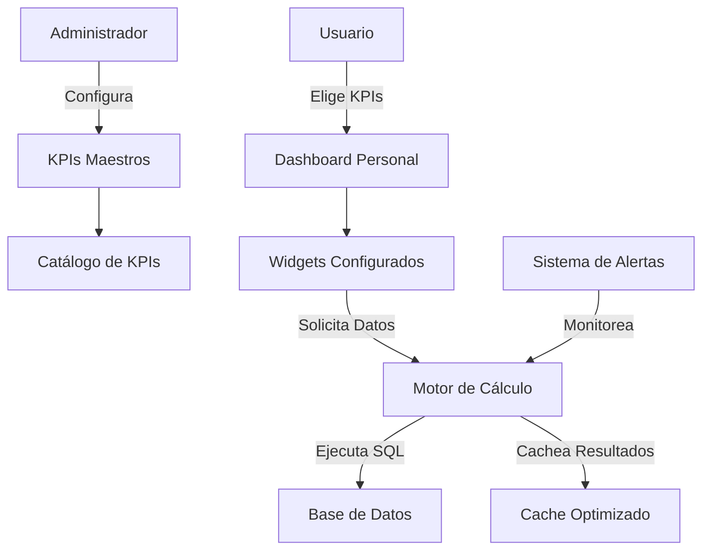

# Sistema de KPIs Personalizados y Dashboards - Guía de Implementación

## 📊 Resumen del Sistema

Este sistema permite que **administradores configuren KPIs** y **usuarios personalicen sus dashboards** con las métricas que elijan. Extiende tu sistema de estadísticas existente con funcionalidad avanzada.

### **🎯 Funcionalidades Principales**

1. **KPIs Configurables** - Administradores crean métricas con fórmulas SQL
2. **Dashboards Personalizables** - Usuarios eligen y organizan sus KPIs
3. **Widgets Flexibles** - Gráficos, números, gauges adaptables
4. **Cache Inteligente** - Optimización automática de rendimiento
5. **Alertas Automáticas** - Notificaciones cuando KPIs superan umbrales
6. **Compartición** - Dashboards públicos y compartidos

---

## 🏗️ Arquitectura del Sistema

### **Flujo Principal**



### **Tablas Principales**

- **`tab_kpis_maestros`**: Definición de KPIs con fórmulas SQL
- **`tab_dashboards_usuarios`**: Dashboards personalizados por usuario
- **`tab_widgets_dashboard`**: Widgets individuales dentro de dashboards
- **`tab_valores_kpi_cache`**: Cache de valores calculados
- **`tab_alertas_kpi`**: Alertas configuradas por usuarios

---

## 🚀 Guía de Implementación Backend

### **1. Endpoints del API**

```python
# FastAPI Router para KPIs y Dashboards
from fastapi import APIRouter, Depends, HTTPException
from typing import List, Optional
import json

kpi_router = APIRouter(prefix="/api/kpis", tags=["KPIs y Dashboards"])

# ===== ENDPOINTS PARA ADMINISTRADORES =====

@kpi_router.post("/admin/kpis")
async def crear_kpi_maestro(kpi_data: KPICreate, admin_user: dict = Depends(verify_admin)):
    """Crear nuevo KPI maestro (solo administradores)"""
    result = await db.execute("""
        INSERT INTO tab_kpis_maestros (
            id_tipo_kpi, nom_kpi, descripcion_kpi, formula_sql,
            unidad_medida, formato_numero, tipo_grafico_sugerido,
            color_primario, solo_administradores, creado_por
        ) VALUES ($1, $2, $3, $4, $5, $6, $7, $8, $9, $10)
        RETURNING id_kpi
    """, kpi_data.id_tipo_kpi, kpi_data.nombre, kpi_data.descripcion,
         kpi_data.formula_sql, kpi_data.unidad_medida, kpi_data.formato_numero,
         kpi_data.tipo_grafico, kpi_data.color, kpi_data.solo_admin, admin_user['id_usuario'])

    return {"success": True, "id_kpi": result['id_kpi']}

@kpi_router.get("/admin/kpis")
async def listar_todos_kpis(admin_user: dict = Depends(verify_admin)):
    """Listar todos los KPIs para administración"""
    result = await db.fetch("SELECT * FROM vw_kpis_disponibles ORDER BY nom_tipo_kpi, nom_kpi")
    return {"kpis": result}

# ===== ENDPOINTS PARA USUARIOS =====

@kpi_router.get("/disponibles")
async def obtener_kpis_disponibles(user: dict = Depends(get_current_user)):
    """Obtener KPIs disponibles para el usuario actual"""
    is_admin = user.get('rol') == 'administrador'

    query = """
        SELECT * FROM vw_kpis_disponibles
        WHERE solo_administradores = FALSE OR $1 = TRUE
        ORDER BY nom_tipo_kpi, nom_kpi
    """
    result = await db.fetch(query, is_admin)
    return {"kpis": result}

@kpi_router.post("/calcular/{kpi_id}")
async def calcular_kpi(kpi_id: int, parametros: dict = {}, user: dict = Depends(get_current_user)):
    """Calcular valor de un KPI específico"""
    result = await db.fetchrow("""
        SELECT fun_calcular_kpi($1, $2::jsonb, FALSE) as resultado
    """, kpi_id, json.dumps(parametros))

    kpi_data = json.loads(result['resultado'])

    if not kpi_data.get('success'):
        raise HTTPException(status_code=400, detail=kpi_data.get('error'))

    return kpi_data

# ===== ENDPOINTS PARA DASHBOARDS =====

@kpi_router.post("/dashboards")
async def crear_dashboard(dashboard_data: DashboardCreate, user: dict = Depends(get_current_user)):
    """Crear nuevo dashboard personalizado"""
    result = await db.fetchrow("""
        SELECT fun_crear_dashboard($1, $2, $3, $4::jsonb, $5) as resultado
    """, user['id_usuario'], dashboard_data.nombre, dashboard_data.descripcion,
         json.dumps(dashboard_data.configuracion), dashboard_data.es_principal)

    response = json.loads(result['resultado'])

    if not response.get('success'):
        raise HTTPException(status_code=400, detail=response.get('error'))

    return response

@kpi_router.get("/dashboards/usuario/{user_id}")
async def obtener_dashboards_usuario(user_id: int, current_user: dict = Depends(get_current_user)):
    """Obtener todos los dashboards de un usuario"""
    # Verificar permisos
    if current_user['id_usuario'] != user_id and current_user.get('rol') != 'administrador':
        raise HTTPException(status_code=403, detail="Sin permisos para ver dashboards de otro usuario")

    result = await db.fetch("""
        SELECT * FROM vw_dashboards_usuarios_completo
        WHERE id_usuario = $1
        ORDER BY es_dashboard_principal DESC, fecha_ultimo_acceso DESC
    """, user_id)

    return {"dashboards": result}

@kpi_router.get("/dashboards/{dashboard_id}")
async def obtener_dashboard_completo(dashboard_id: int, calcular_valores: bool = True,
                                   user: dict = Depends(get_current_user)):
    """Obtener dashboard completo con widgets y valores"""
    result = await db.fetchrow("""
        SELECT fun_obtener_dashboard_completo($1, $2, $3) as resultado
    """, dashboard_id, calcular_valores, user['id_usuario'])

    dashboard_data = json.loads(result['resultado'])

    if not dashboard_data.get('success'):
        raise HTTPException(status_code=404, detail=dashboard_data.get('error'))

    return dashboard_data

@kpi_router.post("/dashboards/{dashboard_id}/widgets")
async def agregar_widget(dashboard_id: int, widget_data: WidgetCreate,
                        user: dict = Depends(get_current_user)):
    """Agregar widget a dashboard"""
    result = await db.fetchrow("""
        SELECT fun_agregar_widget($1, $2, $3::jsonb, $4) as resultado
    """, dashboard_id, widget_data.id_kpi, json.dumps(widget_data.configuracion), user['id_usuario'])

    response = json.loads(result['resultado'])

    if not response.get('success'):
        raise HTTPException(status_code=400, detail=response.get('error'))

    return response

@kpi_router.put("/widgets/{widget_id}/posicion")
async def actualizar_posicion_widget(widget_id: int, nueva_posicion: dict,
                                    user: dict = Depends(get_current_user)):
    """Actualizar posición de widget en dashboard"""
    result = await db.fetchrow("""
        SELECT fun_actualizar_posicion_widget($1, $2::jsonb, $3) as resultado
    """, widget_id, json.dumps(nueva_posicion), user['id_usuario'])

    response = json.loads(result['resultado'])

    if not response.get('success'):
        raise HTTPException(status_code=400, detail=response.get('error'))

    return response

# ===== ENDPOINTS PARA ALERTAS =====

@kpi_router.post("/alertas")
async def crear_alerta_kpi(alerta_data: AlertaCreate, user: dict = Depends(get_current_user)):
    """Crear alerta para monitoreo de KPI"""
    result = await db.execute("""
        INSERT INTO tab_alertas_kpi (
            id_kpi, id_usuario, nom_alerta, tipo_condicion,
            valor_umbral_min, valor_umbral_max, porcentaje_cambio_umbral,
            metodo_notificacion, frecuencia_verificacion
        ) VALUES ($1, $2, $3, $4, $5, $6, $7, $8, $9)
        RETURNING id_alerta
    """, alerta_data.id_kpi, user['id_usuario'], alerta_data.nombre,
         alerta_data.tipo_condicion, alerta_data.umbral_min, alerta_data.umbral_max,
         alerta_data.cambio_porcentual, alerta_data.metodo_notificacion, alerta_data.frecuencia)

    return {"success": True, "id_alerta": result['id_alerta']}

@kpi_router.get("/alertas/usuario")
async def obtener_alertas_usuario(user: dict = Depends(get_current_user)):
    """Obtener alertas configuradas por el usuario"""
    result = await db.fetch("""
        SELECT * FROM vw_alertas_kpi_activas
        WHERE id_usuario = $1
        ORDER BY fec_creacion DESC
    """, user['id_usuario'])

    return {"alertas": result}
```

### **2. Modelos Pydantic**

```python
from pydantic import BaseModel, Field
from typing import Optional, Dict, Any
from enum import Enum

class TipoGrafico(str, Enum):
    NUMERO = "NUMERO"
    GAUGE = "GAUGE"
    LINEA = "LINEA"
    BARRA = "BARRA"
    DONUT = "DONUT"

class FormatoNumero(str, Enum):
    INTEGER = "INTEGER"
    DECIMAL = "DECIMAL"
    CURRENCY = "CURRENCY"
    PERCENTAGE = "PERCENTAGE"

class KPICreate(BaseModel):
    id_tipo_kpi: int
    nombre: str = Field(..., max_length=150)
    descripcion: Optional[str] = None
    formula_sql: str = Field(..., min_length=10)
    unidad_medida: Optional[str] = Field(None, max_length=20)
    formato_numero: FormatoNumero = FormatoNumero.DECIMAL
    rango_esperado_min: Optional[float] = None
    rango_esperado_max: Optional[float] = None
    tipo_grafico: TipoGrafico = TipoGrafico.NUMERO
    color: str = Field("#2ECC71", regex=r"^#[0-9A-Fa-f]{6}$")
    solo_admin: bool = False
    requiere_parametros: bool = False
    parametros_permitidos: Optional[Dict[str, Any]] = None

class DashboardCreate(BaseModel):
    nombre: str = Field(..., max_length=100)
    descripcion: Optional[str] = None
    configuracion: Dict[str, Any] = {}
    es_principal: bool = False

class WidgetCreate(BaseModel):
    id_kpi: int
    configuracion: Dict[str, Any] = {}

class AlertaCreate(BaseModel):
    id_kpi: int
    nombre: str = Field(..., max_length=100)
    tipo_condicion: str = Field(..., regex=r"^(MAYOR_QUE|MENOR_QUE|ENTRE|CAMBIO_PORCENTUAL)$")
    umbral_min: Optional[float] = None
    umbral_max: Optional[float] = None
    cambio_porcentual: Optional[float] = None
    metodo_notificacion: str = "EMAIL"
    frecuencia: str = "HORARIA"
```

---

## 📱 Frontend - Ejemplos de Uso

### **1. Componente React - Selector de KPIs**

```jsx
import React, { useState, useEffect } from "react";
import { Card, Select, Button, Row, Col, Tabs } from "antd";

const KPISelector = ({ onKPISelect }) => {
  const [kpisDisponibles, setKpisDisponibles] = useState([]);
  const [kpisPorTipo, setKpisPorTipo] = useState({});

  useEffect(() => {
    fetchKPIsDisponibles();
  }, []);

  const fetchKPIsDisponibles = async () => {
    try {
      const response = await fetch("/api/kpis/disponibles");
      const data = await response.json();

      setKpisDisponibles(data.kpis);

      // Agrupar KPIs por tipo
      const agrupados = data.kpis.reduce((acc, kpi) => {
        if (!acc[kpi.nom_tipo_kpi]) {
          acc[kpi.nom_tipo_kpi] = [];
        }
        acc[kpi.nom_tipo_kpi].push(kpi);
        return acc;
      }, {});

      setKpisPorTipo(agrupados);
    } catch (error) {
      console.error("Error cargando KPIs:", error);
    }
  };

  const renderKPICard = (kpi) => (
    <Card
      key={kpi.id_kpi}
      size="small"
      style={{ marginBottom: 8, cursor: "pointer" }}
      onClick={() => onKPISelect(kpi)}
      hoverable
    >
      <div style={{ display: "flex", alignItems: "center" }}>
        <i
          className={kpi.icono}
          style={{
            color: kpi.color_categoria,
            marginRight: 8,
            fontSize: 16,
          }}
        />
        <div style={{ flex: 1 }}>
          <div style={{ fontWeight: "bold" }}>{kpi.nom_kpi}</div>
          <div style={{ fontSize: 12, color: "#666" }}>
            {kpi.descripcion_kpi}
          </div>
          <div style={{ fontSize: 11, color: "#999" }}>
            {kpi.unidad_medida} • {kpi.tipo_grafico_sugerido}
            {kpi.solo_administradores && " • Solo Admin"}
          </div>
        </div>
        {kpi.widgets_activos > 0 && (
          <div style={{ fontSize: 11, color: "#52c41a" }}>
            {kpi.widgets_activos} en uso
          </div>
        )}
      </div>
    </Card>
  );

  return (
    <div>
      <h3>📊 Seleccionar KPIs para Dashboard</h3>
      <Tabs
        items={Object.entries(kpisPorTipo).map(([tipo, kpis]) => ({
          key: tipo,
          label: (
            <span>
              <i className={kpis[0]?.icono} style={{ marginRight: 4 }} />
              {tipo} ({kpis.length})
            </span>
          ),
          children: (
            <div style={{ maxHeight: 400, overflowY: "auto" }}>
              {kpis.map(renderKPICard)}
            </div>
          ),
        }))}
      />
    </div>
  );
};

export default KPISelector;
```

### **2. Componente React - Widget de KPI**

```jsx
import React, { useState, useEffect } from "react";
import { Card, Statistic, Progress, Spin } from "antd";
import { Line, Gauge } from "@ant-design/plots";

const KPIWidget = ({ widget, calcularValores = true }) => {
  const [valorKPI, setValorKPI] = useState(null);
  const [loading, setLoading] = useState(calcularValores);

  useEffect(() => {
    if (calcularValores) {
      calcularValorKPI();
    }
  }, [widget.id_kpi, widget.parametros_kpi]);

  const calcularValorKPI = async () => {
    setLoading(true);
    try {
      const response = await fetch(`/api/kpis/calcular/${widget.id_kpi}`, {
        method: "POST",
        headers: { "Content-Type": "application/json" },
        body: JSON.stringify(widget.parametros_kpi || {}),
      });

      const data = await response.json();
      setValorKPI(data);
    } catch (error) {
      console.error("Error calculando KPI:", error);
    } finally {
      setLoading(false);
    }
  };

  const formatearValor = (valor) => {
    if (!valor) return "0";

    const formato = widget.kpi_info?.formato_numero || "DECIMAL";
    const unidad = widget.kpi_info?.unidad_medida || "";

    switch (formato) {
      case "CURRENCY":
        return `${valor.toLocaleString("es-ES", {
          minimumFractionDigits: 2,
          maximumFractionDigits: 2,
        })}€`;
      case "PERCENTAGE":
        return `${valor}%`;
      case "INTEGER":
        return valor.toLocaleString("es-ES");
      default:
        return `${valor.toLocaleString("es-ES")} ${unidad}`.trim();
    }
  };

  const renderContenido = () => {
    if (loading) {
      return <Spin size="large" />;
    }

    if (!valorKPI?.success) {
      return <div style={{ color: "#ff4d4f" }}>Error cargando datos</div>;
    }

    const tipoGrafico = widget.configuracion_visual?.tipo_grafico || "NUMERO";
    const valor = valorKPI.valor_actual;
    const valorAnterior = valorKPI.valor_anterior;
    const porcentajeCambio = valorKPI.porcentaje_cambio;
    const tendencia = valorKPI.tendencia;

    switch (tipoGrafico) {
      case "GAUGE":
        const config = {
          percent: Math.min(
            valor / (widget.kpi_info?.rango_esperado_max || valor * 2),
            1
          ),
          range: { color: widget.configuracion_visual?.color || "#2ECC71" },
          indicator: false,
          statistic: {
            content: {
              style: { fontSize: 24, fontWeight: "bold" },
              formatter: () => formatearValor(valor),
            },
          },
        };
        return <Gauge {...config} height={120} />;

      case "NUMERO":
      default:
        return (
          <div>
            <Statistic
              title={widget.configuracion_visual?.titulo}
              value={valor}
              formatter={(val) => formatearValor(val)}
              valueStyle={{
                color: widget.configuracion_visual?.color || "#2ECC71",
                fontSize: 28,
              }}
            />

            {widget.configuracion_visual?.mostrar_porcentaje_cambio &&
              porcentajeCambio !== null && (
                <div
                  style={{
                    fontSize: 14,
                    color:
                      tendencia === "POSITIVA"
                        ? "#52c41a"
                        : tendencia === "NEGATIVA"
                        ? "#ff4d4f"
                        : "#666",
                    marginTop: 8,
                  }}
                >
                  {tendencia === "POSITIVA"
                    ? "↗️"
                    : tendencia === "NEGATIVA"
                    ? "↘️"
                    : "➡️"}
                  {Math.abs(porcentajeCambio)}% vs anterior
                </div>
              )}

            {widget.configuracion_visual?.mostrar_valor_anterior &&
              valorAnterior !== null && (
                <div style={{ fontSize: 12, color: "#999", marginTop: 4 }}>
                  Anterior: {formatearValor(valorAnterior)}
                </div>
              )}
          </div>
        );
    }
  };

  return (
    <Card
      size="small"
      style={{
        height: widget.posicion?.alto * 120 || 200,
        backgroundColor:
          valorKPI?.metadata?.rango_esperado?.dentro_rango === false
            ? "#fff2f0"
            : "white",
      }}
      bodyStyle={{
        height: "100%",
        display: "flex",
        flexDirection: "column",
        justifyContent: "center",
      }}
    >
      {renderContenido()}

      {valorKPI?.origen === "CACHE" && (
        <div
          style={{
            position: "absolute",
            top: 4,
            right: 4,
            fontSize: 10,
            color: "#999",
          }}
        >
          📄 Cache
        </div>
      )}
    </Card>
  );
};

export default KPIWidget;
```

### **3. Dashboard Grid Personalizable**

```jsx
import React, { useState, useEffect } from "react";
import { GridLayout } from "react-grid-layout";
import { Button, Modal, Row, Col } from "antd";
import KPIWidget from "./KPIWidget";
import KPISelector from "./KPISelector";

const DashboardPersonalizado = ({ dashboardId }) => {
  const [dashboard, setDashboard] = useState(null);
  const [widgets, setWidgets] = useState([]);
  const [modalKPIVisible, setModalKPIVisible] = useState(false);
  const [layouts, setLayouts] = useState([]);

  useEffect(() => {
    cargarDashboard();
  }, [dashboardId]);

  const cargarDashboard = async () => {
    try {
      const response = await fetch(`/api/kpis/dashboards/${dashboardId}`);
      const data = await response.json();

      if (data.success) {
        setDashboard(data.dashboard);
        setWidgets(data.widgets);

        // Convertir widgets a layout de react-grid-layout
        const gridLayouts = data.widgets.map((widget) => ({
          i: widget.id_widget.toString(),
          x: widget.posicion.x,
          y: widget.posicion.y,
          w: widget.posicion.ancho,
          h: widget.posicion.alto,
          widget: widget,
        }));

        setLayouts(gridLayouts);
      }
    } catch (error) {
      console.error("Error cargando dashboard:", error);
    }
  };

  const agregarWidget = async (kpiSeleccionado) => {
    try {
      const response = await fetch(
        `/api/kpis/dashboards/${dashboardId}/widgets`,
        {
          method: "POST",
          headers: { "Content-Type": "application/json" },
          body: JSON.stringify({
            id_kpi: kpiSeleccionado.id_kpi,
            configuracion: {
              tipo_grafico: kpiSeleccionado.tipo_grafico_sugerido,
              color_personalizado: kpiSeleccionado.color_primario,
              mostrar_titulo: true,
              mostrar_valor_anterior: true,
              mostrar_porcentaje_cambio: true,
            },
          }),
        }
      );

      const data = await response.json();

      if (data.success) {
        setModalKPIVisible(false);
        cargarDashboard(); // Recargar dashboard
      }
    } catch (error) {
      console.error("Error agregando widget:", error);
    }
  };

  const onLayoutChange = async (nuevoLayout) => {
    // Actualizar posiciones en backend
    for (const item of nuevoLayout) {
      if (item.moved || item.resized) {
        try {
          await fetch(`/api/kpis/widgets/${item.i}/posicion`, {
            method: "PUT",
            headers: { "Content-Type": "application/json" },
            body: JSON.stringify({
              x: item.x,
              y: item.y,
              ancho: item.w,
              alto: item.h,
            }),
          });
        } catch (error) {
          console.error("Error actualizando posición:", error);
        }
      }
    }
  };

  return (
    <div>
      <Row justify="space-between" align="middle" style={{ marginBottom: 16 }}>
        <Col>
          <h2>📊 {dashboard?.nombre}</h2>
          <p style={{ color: "#666" }}>{dashboard?.descripcion}</p>
        </Col>
        <Col>
          <Button
            type="primary"
            onClick={() => setModalKPIVisible(true)}
            icon="+"
          >
            Agregar KPI
          </Button>
        </Col>
      </Row>

      <GridLayout
        className="layout"
        layout={layouts}
        cols={dashboard?.configuracion_visual?.columnas_grid || 3}
        rowHeight={120}
        width={1200}
        onLayoutChange={onLayoutChange}
        isDraggable={true}
        isResizable={true}
      >
        {layouts.map((item) => (
          <div key={item.i}>
            <KPIWidget widget={item.widget} calcularValores={true} />
          </div>
        ))}
      </GridLayout>

      <Modal
        title="Seleccionar KPI para agregar"
        open={modalKPIVisible}
        onCancel={() => setModalKPIVisible(false)}
        footer={null}
        width={800}
      >
        <KPISelector onKPISelect={agregarWidget} />
      </Modal>
    </div>
  );
};

export default DashboardPersonalizado;
```

---

## ⚡ Optimizaciones y Mejores Prácticas

### **1. Cache Inteligente**

```sql
-- El sistema incluye cache automático que:
-- ✅ Evita recálculos innecesarios
-- ✅ Se limpia automáticamente
-- ✅ Respeta la frecuencia configurada de cada KPI

-- Ejemplo: KPI que se actualiza solo cada hora
UPDATE tab_kpis_maestros
SET frecuencia_actualizacion = 'HORARIA',
    duracion_cache_minutos = 60
WHERE nom_kpi = 'Ventas Totales del Mes';
```

### **2. Jobs de Mantenimiento**

```python
# Job de limpieza (ejecutar cada 6 horas)
@scheduler.scheduled_job('interval', hours=6)
async def limpiar_cache_kpis():
    await db.fetchrow("SELECT fun_limpiar_cache_expirado()")

# Job de verificación de alertas (ejecutar cada 15 minutos)
@scheduler.scheduled_job('interval', minutes=15)
async def verificar_alertas():
    await db.fetchrow("SELECT fun_verificar_alertas_kpi()")
```

### **3. Seguridad y Permisos**

```python
def verify_kpi_access(kpi_id: int, user: dict):
    """Verificar que el usuario puede acceder al KPI"""
    kpi = get_kpi_by_id(kpi_id)

    if kpi.solo_administradores and user.get('rol') != 'administrador':
        raise HTTPException(status_code=403, detail="KPI solo para administradores")

    return True

def validate_sql_formula(formula: str):
    """Validar que la fórmula SQL sea segura"""
    forbidden_keywords = ['DROP', 'DELETE', 'UPDATE', 'INSERT', 'ALTER', 'CREATE']

    for keyword in forbidden_keywords:
        if keyword.upper() in formula.upper():
            raise ValueError(f"Palabra prohibida en fórmula: {keyword}")

    return True
```

---

## 📈 Casos de Uso Prácticos

### **1. Dashboard del CEO**

- **KPIs**: Ventas totales, crecimiento mensual, nuevos clientes
- **Configuración**: Gráficos gauge, actualización tiempo real
- **Alertas**: Si ventas bajan >10% vs mes anterior

### **2. Dashboard del Gerente de Ventas**

- **KPIs**: Órdenes del día, ticket promedio, conversión
- **Configuración**: Números grandes, gráficos de línea
- **Alertas**: Si órdenes pendientes >50

### **3. Dashboard del Gerente de Inventario**

- **KPIs**: Stock bajo, rotación, productos sin ventas
- **Configuración**: Alertas automáticas, colores de advertencia
- **Alertas**: Si stock bajo >20 productos

### **4. Dashboard del Analista**

- **KPIs**: Todos los KPIs disponibles, análisis históricos
- **Configuración**: Gráficos detallados, datos de comparación
- **Alertas**: Cambios significativos en cualquier métrica

---

## 🎉 Beneficios del Sistema

### **Para el Negocio**

- ✅ **Visibilidad en Tiempo Real** de métricas clave
- ✅ **Decisiones Basadas en Datos** más rápidas y precisas
- ✅ **Alertas Proactivas** para problemas o oportunidades
- ✅ **Personalización Total** según roles y necesidades

### **Para los Usuarios**

- ✅ **Dashboards Personalizados** con sus métricas favoritas
- ✅ **Interfaz Intuitiva** tipo drag-and-drop
- ✅ **Actualizaciones Automáticas** sin recargar página
- ✅ **Acceso Móvil** responsive en cualquier dispositivo

### **Para Desarrolladores**

- ✅ **Arquitectura Extensible** fácil de mantener y ampliar
- ✅ **Cache Automático** para rendimiento óptimo
- ✅ **APIs RESTful** bien documentadas
- ✅ **Escalabilidad** para miles de usuarios y KPIs

---

## 🚀 Siguientes Pasos

1. **Implementar Backend**: Usar los endpoints de ejemplo
2. **Crear Frontend**: Componentes React personalizables
3. **Configurar Jobs**: Mantenimiento automático de cache y alertas
4. **Capacitar Usuarios**: Documentación y tutoriales
5. **Monitorear Rendimiento**: Métricas de uso y optimización

¡Tu sistema de estadísticas existente ahora puede evolucionar a una **plataforma completa de Business Intelligence** personalizable! 🎯
