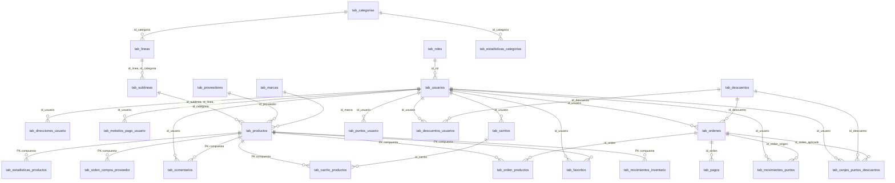

# Documentación completa: Base de datos Revital (E-commerce)

Documento único de referencia: **tablas**, **campos**, **conexiones (FK)**, **funciones**, **triggers** y **vistas** del esquema `db_revital.sql` (Revital E-commerce).

---

## 1. Descripción general

- **Proyecto:** Revital E-commerce (instancia por cliente).
- **Motor:** PostgreSQL.
- **Script principal:** `db/db_revital.sql`.
- **Estructura:** Tablas base (roles, categorías, marcas, proveedores) → jerarquía categoría/línea/sublínea/producto → usuarios, carritos, órdenes, pagos, descuentos, fidelización (puntos, canjes), CMS, estadísticas.

---

## 2. Orden de dependencias (DROP / creación)

Al recrear la base, el orden correcto es eliminar en orden inverso a las dependencias:

| Nivel | Tablas (DROP en este orden) |
|-------|-----------------------------|
| Vistas | `vw_resumen_puntos_usuario`, `vw_descuentos_canjeables` |
| Nivel 4 | `tab_movimientos_inventario`, `tab_carrito_productos`, `tab_orden_productos`, `tab_favoritos`, `tab_orden_compra_proveedor`, `tab_estadisticas_productos`, `tab_estadisticas_categorias` |
| Nivel 3 | `tab_pagos`, `tab_metodos_pago_usuario`, `tab_canjes_puntos_descuentos`, `tab_movimientos_puntos`, `tab_puntos_usuario`, `tab_descuentos_usuarios`, `tab_ordenes`, `tab_descuentos` |
| Nivel 2 | `tab_comentarios`, `tab_productos`, `tab_carritos`, `tab_direcciones_usuario`, `tab_sublineas`, `tab_lineas`, `tab_usuarios` |
| Nivel 1 | `tab_categorias`, `tab_marcas`, `tab_proveedores`, `tab_roles`, `tab_cms_content`, `tab_config_puntos_empresa`, `tab_reg_del` |

---

## 3. Diagrama ER simplificado (Mermaid)

---

## 4. Tablas y campos

A continuación se listan todas las tablas con sus columnas (tipo y restricciones principales).

### 4.1 tab_reg_del
| Campo | Tipo | Restricciones |
|-------|------|---------------|
| id_del | SERIAL | PRIMARY KEY |
| tab_name | VARCHAR | NOT NULL |
| atributos | JSONB | NOT NULL |
| usr_delete | VARCHAR | NOT NULL |
| fec_delete | TIMESTAMP WITHOUT TIME ZONE | NOT NULL |

### 4.2 tab_categorias
| Campo | Tipo | Restricciones |
|-------|------|---------------|
| id_categoria | DECIMAL(10) | PRIMARY KEY |
| nom_categoria | VARCHAR | NOT NULL, UNIQUE |
| ind_activo | BOOLEAN | DEFAULT TRUE |
| usr_insert | DECIMAL(10) | NOT NULL |
| fec_insert | TIMESTAMP WITHOUT TIME ZONE | NOT NULL |
| usr_update | DECIMAL(10) | — |
| fec_update | TIMESTAMP WITHOUT TIME ZONE | — |

### 4.3 tab_lineas
| Campo | Tipo | Restricciones |
|-------|------|---------------|
| id_categoria | DECIMAL(10) | FK → tab_categorias, parte PK |
| id_linea | DECIMAL(10) | PRIMARY KEY (con id_categoria) |
| nom_linea | VARCHAR | NOT NULL, UNIQUE |
| ind_activo | BOOLEAN | DEFAULT TRUE |
| usr_insert, fec_insert, usr_update, fec_update | — | Auditoría |

### 4.4 tab_sublineas
| Campo | Tipo | Restricciones |
|-------|------|---------------|
| id_categoria | DECIMAL(10) | FK → tab_lineas, parte PK |
| id_linea | DECIMAL(10) | FK → tab_lineas, parte PK |
| id_sublinea | DECIMAL(10) | PRIMARY KEY (con id_linea, id_categoria) |
| nom_sublinea | VARCHAR | NOT NULL |
| ind_activo | BOOLEAN | DEFAULT TRUE |
| usr_insert, fec_insert, usr_update, fec_update | — | Auditoría |

### 4.5 tab_estadisticas_categorias
| Campo | Tipo | Restricciones |
|-------|------|---------------|
| id_categoria | DECIMAL(10) | PRIMARY KEY, FK → tab_categorias |
| nom_categoria | VARCHAR(255) | — |
| categoria_activa | BOOLEAN | — |
| total_productos, productos_activos, productos_con_ventas | INT | DEFAULT 0 |
| total_ordenes, total_unidades_vendidas | INT | DEFAULT 0 |
| total_ingresos | DECIMAL(15,2) | DEFAULT 0 |
| ventas_mes_actual, ingresos_mes_actual, ventas_mes_anterior, ingresos_mes_anterior | INT/DECIMAL | DEFAULT 0 |
| participacion_ventas, crecimiento_mensual, precio_promedio_categoria | DECIMAL | DEFAULT 0 |
| producto_mas_vendido, producto_mayor_ingreso | VARCHAR(255) | — |
| unidades_top_producto | INT | DEFAULT 0 |
| fecha_primera_venta, fecha_ultima_venta, mejor_mes_ventas | DATE/VARCHAR(7) | — |
| ultima_actualizacion | TIMESTAMP | DEFAULT NOW() |
| periodo_calculo | VARCHAR(7) | — |

### 4.6 tab_roles
| Campo | Tipo | Restricciones |
|-------|------|---------------|
| id_rol | DECIMAL(1) | PRIMARY KEY |
| nom_rol | VARCHAR | NOT NULL, UNIQUE |
| des_rol | VARCHAR | — |
| usr_insert, fec_insert, usr_update, fec_update | — | Auditoría |

### 4.7 tab_usuarios
| Campo | Tipo | Restricciones |
|-------|------|---------------|
| id_usuario | DECIMAL(10) | PRIMARY KEY |
| nom_usuario, ape_usuario | VARCHAR | NOT NULL |
| email_usuario | VARCHAR | NOT NULL, UNIQUE |
| password_usuario | VARCHAR | NOT NULL |
| id_rol | DECIMAL(1) | FK → tab_roles, DEFAULT 2 |
| ind_genero | BOOLEAN | NOT NULL |
| cel_usuario | VARCHAR | NOT NULL |
| fec_nacimiento | DATE | — |
| ind_activo | BOOLEAN | DEFAULT TRUE |
| usr_insert, fec_insert, usr_update, fec_update | — | Auditoría |

### 4.8 tab_direcciones_usuario
| Campo | Tipo | Restricciones |
|-------|------|---------------|
| id_direccion | DECIMAL | PRIMARY KEY |
| id_usuario | DECIMAL(10) | NOT NULL, FK → tab_usuarios |
| nombre_direccion, calle_direccion, ciudad, departamento, codigo_postal, barrio | VARCHAR | NOT NULL (calle ≥5, nombre ≥2) |
| referencias, complemento | VARCHAR | — |
| ind_principal | BOOLEAN | NOT NULL DEFAULT FALSE |
| ind_activa | BOOLEAN | NOT NULL DEFAULT TRUE |
| usr_insert, fec_insert, usr_update, fec_update | — | Auditoría |

### 4.9 tab_metodos_pago_usuario
| Campo | Tipo | Restricciones |
|-------|------|---------------|
| id_metodo_pago | SERIAL | PRIMARY KEY |
| id_usuario | DECIMAL(10) | NOT NULL, FK → tab_usuarios |
| provider_name | VARCHAR(50) | NOT NULL DEFAULT 'wompi' |
| provider_source_id | VARCHAR(255) | NOT NULL |
| brand, last_four_digits, expiration_month, expiration_year, card_holder | VARCHAR/INT | — |
| is_default | BOOLEAN | NOT NULL DEFAULT FALSE |
| usr_insert, fec_insert, usr_update, fec_update | — | Auditoría |
| UNIQUE(id_usuario, provider_source_id, provider_name) | — | — |

### 4.10 tab_carritos
| Campo | Tipo | Restricciones |
|-------|------|---------------|
| id_carrito | SERIAL | PRIMARY KEY |
| id_usuario | DECIMAL(10) | FK → tab_usuarios, nullable |
| session_id | VARCHAR | nullable |
| usr_insert, fec_insert, usr_update, fec_update | — | Auditoría |
| CHECK (id_usuario IS NOT NULL OR session_id IS NOT NULL) | — | — |

### 4.11 tab_proveedores
| Campo | Tipo | Restricciones |
|-------|------|---------------|
| id_proveedor | DECIMAL(10) | PRIMARY KEY |
| nom_proveedor | VARCHAR | NOT NULL |
| email | VARCHAR | NOT NULL, UNIQUE |
| tel_proveedor | DECIMAL(15) | NOT NULL |
| ind_activo | BOOLEAN | DEFAULT TRUE |
| usr_insert, fec_insert, usr_update, fec_update | — | Auditoría |

### 4.12 tab_marcas
| Campo | Tipo | Restricciones |
|-------|------|---------------|
| id_marca | DECIMAL(10) | PRIMARY KEY |
| nom_marca | VARCHAR | NOT NULL, UNIQUE |
| ind_activo | BOOLEAN | DEFAULT TRUE |
| usr_insert, fec_insert, usr_update, fec_update | — | Auditoría |

### 4.13 tab_productos
| Campo | Tipo | Restricciones |
|-------|------|---------------|
| id_categoria, id_linea, id_sublinea | DECIMAL(10) | FK → tab_sublineas, parte PK |
| id_producto | DECIMAL(10) | PRIMARY KEY (con id_categoria, id_linea, id_sublinea) |
| nom_producto | VARCHAR | NOT NULL |
| spcf_producto | JSONB | NOT NULL |
| img_producto | JSONB | — |
| val_precio | DECIMAL(10) | NOT NULL, CHECK ≥ 0 |
| id_proveedor | DECIMAL(10) | NOT NULL, FK → tab_proveedores |
| id_marca | DECIMAL(10) | NOT NULL, FK → tab_marcas |
| num_stock | INT | NOT NULL DEFAULT 0, CHECK ≥ 0 |
| ind_activo | BOOLEAN | DEFAULT TRUE |
| usr_insert, fec_insert, usr_update, fec_update | — | Auditoría |

### 4.14 tab_orden_compra_proveedor
| Campo | Tipo | Restricciones |
|-------|------|---------------|
| id_orden_compra | DECIMAL(10) | PRIMARY KEY |
| id_proveedor | DECIMAL(10) | NOT NULL, FK → tab_proveedores |
| fec_orden_compra | DATE | NOT NULL DEFAULT CURRENT_DATE |
| fec_esperada_entrega | DATE | NOT NULL |
| observaciones_orden | VARCHAR | — |
| id_categoria, id_linea, id_sublinea, id_producto | DECIMAL(10) | NOT NULL, FK → tab_productos |
| cantidad_solicitada | INT | NOT NULL, CHECK > 0 |
| cantidad_recibida | INT | NOT NULL DEFAULT 0, CHECK ≥ 0 |
| costo_unitario | DECIMAL(10,2) | NOT NULL, CHECK ≥ 0 |
| subtotal_producto | DECIMAL(12,2) | GENERATED (cantidad_solicitada * costo_unitario) |
| ind_estado_producto | DECIMAL(1) | NOT NULL DEFAULT 1, CHECK 1–4 |
| fec_recepcion_completa | TIMESTAMP | — |
| observaciones_producto | VARCHAR | — |
| usr_insert, fec_insert, usr_update, fec_update | — | Auditoría |

### 4.15 tab_comentarios
| Campo | Tipo | Restricciones |
|-------|------|---------------|
| id_categoria, id_linea, id_sublinea, id_producto | DECIMAL(10) | NOT NULL, FK → tab_productos, parte PK |
| id_usuario | DECIMAL(10) | NOT NULL, FK → tab_usuarios |
| id_orden | DECIMAL(10) | NOT NULL, FK → tab_ordenes |
| id_comentario | DECIMAL(10) | NOT NULL, parte PK |
| comentario | VARCHAR | NOT NULL, LENGTH ≥ 3 |
| calificacion | INT | NOT NULL, CHECK 1–5 |
| ind_activo | BOOLEAN | NOT NULL DEFAULT TRUE |
| usr_insert, fec_insert, usr_update, fec_update | — | Auditoría |
| UNIQUE(id_usuario, id_orden, id_categoria, id_linea, id_sublinea, id_producto) | — | — |

### 4.16 tab_descuentos
| Campo | Tipo | Restricciones |
|-------|------|---------------|
| id_descuento | DECIMAL(10) | PRIMARY KEY |
| nom_descuento | VARCHAR | NOT NULL |
| des_descuento | VARCHAR | — |
| tipo_calculo | BOOLEAN | NOT NULL (TRUE=%, FALSE=monto) |
| val_porce_descuento | DECIMAL(10,2) | NOT NULL |
| val_monto_descuento | DECIMAL(10,0) | NOT NULL |
| aplica_a | VARCHAR(30) | NOT NULL (total_pedido, producto_especifico, marca_especifica, categoria_especifica, linea_especifica, sublinea_especifica, etc.) |
| id_categoria, id_linea, id_sublinea, id_producto_aplica, id_categoria_aplica, id_marca_aplica, id_linea_aplica, id_sublinea_aplica | DECIMAL(10) | NULL, FKs condicionales a productos/categorias/marcas/lineas/sublineas |
| min_valor_pedido | DECIMAL(10,2) | DEFAULT 0 |
| ind_es_para_cumpleanos | BOOLEAN | DEFAULT FALSE |
| fec_inicio, fec_fin | DATE | NULL (reglas CHECK) |
| ind_activo | BOOLEAN | DEFAULT TRUE |
| max_usos_total, usos_actuales_total | INT | NULL / DEFAULT 0 |
| costo_puntos_canje | INT | NULL, CHECK > 0 si canjeable |
| ind_canjeable_puntos | BOOLEAN | NOT NULL DEFAULT FALSE |
| codigo_descuento | VARCHAR | UNIQUE |
| max_usos_por_usuario | INT | NULL |
| dias_semana_aplica, horas_inicio, horas_fin | VARCHAR/TIME | — |
| solo_primera_compra | BOOLEAN | DEFAULT FALSE |
| monto_minimo_producto, cantidad_minima_producto | DECIMAL/INT | DEFAULT 0/1 |
| requiere_codigo | BOOLEAN | DEFAULT FALSE |
| usr_insert, fec_insert, usr_update, fec_update | — | Auditoría |

### 4.17 tab_descuentos_usuarios
| Campo | Tipo | Restricciones |
|-------|------|---------------|
| id_descuento | DECIMAL(10) | NOT NULL, FK → tab_descuentos |
| id_usuario | DECIMAL(10) | NOT NULL, FK → tab_usuarios |
| veces_usado | INT | DEFAULT 1, CHECK ≥ 1 |
| usr_insert, fec_insert, usr_update, fec_update | — | Auditoría |
| UNIQUE(id_descuento, id_usuario) | — | — |

### 4.18 tab_ordenes
| Campo | Tipo | Restricciones |
|-------|------|---------------|
| id_orden | DECIMAL(10) | PRIMARY KEY |
| fec_pedido | TIMESTAMP WITHOUT TIME ZONE | NOT NULL DEFAULT NOW() |
| id_usuario | DECIMAL(10) | NOT NULL, FK → tab_usuarios |
| val_total_productos | DECIMAL(10,0) | NOT NULL, CHECK ≥ 0 |
| val_total_descuentos | DECIMAL(10,0) | NOT NULL DEFAULT 0, CHECK ≥ 0 |
| val_total_pedido | DECIMAL(10,0) | NOT NULL, CHECK ≥ 0 |
| ind_estado | DECIMAL(1) | NOT NULL DEFAULT 1, CHECK 1–3 (1=pendiente, 2=pagada, 3=completada, 4=cancelada en triggers) |
| metodo_pago | VARCHAR(50) | CHECK IN ('tarjeta','efectivo_red_pagos','transferencia') |
| id_descuento | DECIMAL(10) | FK → tab_descuentos |
| detalle_descuentos_aplicados | JSON | — |
| des_observaciones | VARCHAR | — |
| usr_insert, fec_insert, usr_update, fec_update | — | Auditoría |
| CHECK (val_total_pedido = val_total_productos - val_total_descuentos) | — | — |

### 4.19 tab_pagos
| Campo | Tipo | Restricciones |
|-------|------|---------------|
| id_pago | SERIAL | PRIMARY KEY |
| id_orden | DECIMAL(10) | NOT NULL, FK → tab_ordenes |
| reference | VARCHAR(255) | — |
| provider_transaction_id | VARCHAR(255) | — |
| provider_name | VARCHAR(50) | NOT NULL DEFAULT 'wompi' |
| status | VARCHAR(50) | NOT NULL (CREATED, PENDING, APPROVED, DECLINED, VOIDED, ERROR) |
| status_detail | VARCHAR(100) | — |
| amount | DECIMAL(12,2) | NOT NULL, CHECK > 0 |
| currency_id | VARCHAR(10) | NOT NULL DEFAULT 'COP' |
| installments | INTEGER | — |
| payment_method_type | VARCHAR(50) | — |
| payment_method_extra | JSONB | — |
| fee_amount | DECIMAL(10,2) | DEFAULT 0 |
| net_received_amount | DECIMAL(12,2) | — |
| provider_date_created, provider_date_approved | TIMESTAMP | — |
| raw_response, raw_last_event | JSONB | — |
| parent_payment_id | INTEGER | FK → tab_pagos |
| estado_procesamiento | VARCHAR(20) | DEFAULT 'pendiente', CHECK IN ('pendiente','procesado','error','cancelado') |
| usr_insert, fec_insert, usr_update, fec_update | — | Auditoría |

### 4.20 tab_orden_productos
| Campo | Tipo | Restricciones |
|-------|------|---------------|
| id_orden_producto | DECIMAL(10) | PRIMARY KEY |
| id_categoria_producto, id_linea_producto, id_sublinea_producto, id_producto | DECIMAL(10) | NOT NULL, FK → tab_productos |
| id_orden | DECIMAL(10) | NOT NULL, FK → tab_ordenes |
| cant_producto | INT | NOT NULL, CHECK > 0 |
| precio_unitario_orden | DECIMAL(10,0) | NOT NULL, CHECK ≥ 0 |
| subtotal | DECIMAL(10,0) | NOT NULL, CHECK ≥ 0 |
| usr_insert, fec_insert, usr_update, fec_update | — | Auditoría |
| UNIQUE(id_orden, id_categoria_producto, id_linea_producto, id_sublinea_producto, id_producto) | — | — |
| CHECK (subtotal = cant_producto * precio_unitario_orden) | — | — |

### 4.21 tab_carrito_productos
| Campo | Tipo | Restricciones |
|-------|------|---------------|
| id_carrito_producto | SERIAL | PRIMARY KEY |
| id_carrito | INT | NOT NULL, FK → tab_carritos |
| id_categoria_producto, id_linea_producto, id_sublinea_producto, id_producto | DECIMAL(10) | NOT NULL, FK → tab_productos |
| cantidad | INT | NOT NULL DEFAULT 1, CHECK > 0 |
| precio_unitario_carrito | DECIMAL(7,0) | NOT NULL, CHECK ≥ 0 |
| usr_insert, fec_insert, usr_update, fec_update | — | Auditoría |
| UNIQUE(id_carrito, id_categoria_producto, id_linea_producto, id_sublinea_producto, id_producto) | — | — |

### 4.22 tab_movimientos_inventario
| Campo | Tipo | Restricciones |
|-------|------|---------------|
| id_movimiento | SERIAL | PRIMARY KEY |
| id_categoria_producto, id_linea_producto, id_sublinea_producto, id_producto | DECIMAL(10) | NOT NULL, FK → tab_productos |
| tipo_movimiento | VARCHAR(25) | NOT NULL, CHECK IN ('entrada_compra','salida_venta','ajuste_incremento','ajuste_decremento','devolucion_usuario','devolucion_proveedor','inventario_inicial') |
| cantidad | INT | NOT NULL, CHECK ≥ 0 |
| costo_unitario_movimiento | DECIMAL(10,2) | — |
| stock_anterior, stock_actual | INT | — |
| saldo_costo_total_anterior_mov, saldo_costo_total_actual_mov | DECIMAL(12,2) | — |
| costo_promedio_ponderado_mov | DECIMAL(10,2) | — |
| id_orden_usuario_detalle | DECIMAL(10) | FK → tab_orden_productos |
| id_orden_compra | DECIMAL(10) | FK → tab_orden_compra_proveedor |
| descripcion, observaciones | VARCHAR | — |
| usr_insert, fec_insert, usr_update, fec_update | — | Auditoría |

### 4.23 tab_estadisticas_productos
| Campo | Tipo | Restricciones |
|-------|------|---------------|
| id_categoria, id_linea, id_sublinea, id_producto | DECIMAL(10) | NOT NULL, FK → tab_productos, PRIMARY KEY |
| nom_producto | VARCHAR(255) | — |
| precio_actual | DECIMAL(10,2) | — |
| stock_actual | INT | — |
| producto_activo | BOOLEAN | — |
| total_ordenes, total_unidades_vendidas | INT | DEFAULT 0 |
| total_ingresos | DECIMAL(15,2) | DEFAULT 0 |
| ventas_mes_actual, ingresos_mes_actual, ventas_mes_anterior, ingresos_mes_anterior | INT/DECIMAL | DEFAULT 0 |
| promedio_venta_mensual, promedio_ingreso_mensual, precio_promedio_venta | DECIMAL | DEFAULT 0 |
| fecha_primera_venta, fecha_ultima_venta | DATE | — |
| mes_mejor_venta | VARCHAR(7) | — |
| mejor_venta_unidades | INT | DEFAULT 0 |
| dias_desde_ultima_venta | INT | — |
| rotacion_inventario | DECIMAL(5,2) | DEFAULT 0 |
| nivel_rotacion | VARCHAR(20) | — |
| ultima_actualizacion | TIMESTAMP | DEFAULT NOW() |
| periodo_calculo | VARCHAR(7) | — |

### 4.24 tab_cms_content
| Campo | Tipo | Restricciones |
|-------|------|---------------|
| id_cms_content | SERIAL | PRIMARY KEY |
| nom_cms_content | VARCHAR | NOT NULL |
| des_cms_content | JSONB | NOT NULL |
| num_version | INTEGER | DEFAULT 1 |
| ind_publicado | BOOLEAN | DEFAULT FALSE |
| usr_insert, fec_insert, usr_update, fec_update | — | Auditoría |

### 4.25 tab_favoritos
| Campo | Tipo | Restricciones |
|-------|------|---------------|
| id_usuario | DECIMAL(10) | NOT NULL, FK → tab_usuarios, parte PK |
| id_categoria_producto, id_linea_producto, id_sublinea_producto, id_producto | DECIMAL(10) | NOT NULL, FK → tab_productos, parte PK |
| usr_insert, fec_insert | — | Auditoría |
| PRIMARY KEY (id_usuario, id_categoria_producto, id_linea_producto, id_sublinea_producto, id_producto) | — | — |

### 4.26 tab_config_puntos_empresa
| Campo | Tipo | Restricciones |
|-------|------|---------------|
| id_config_puntos | SERIAL | PRIMARY KEY |
| pesos_por_punto | DECIMAL(10,2) | NOT NULL, CHECK > 0 |
| ind_activo | BOOLEAN | NOT NULL DEFAULT TRUE |
| descripcion | VARCHAR | NOT NULL DEFAULT '...' |
| fec_inicio_vigencia | DATE | NOT NULL DEFAULT CURRENT_DATE |
| fec_fin_vigencia | DATE | NULL |
| usr_insert, fec_insert, usr_update, fec_update | — | Auditoría |
| CHECK (fec_fin_vigencia IS NULL OR fec_fin_vigencia >= fec_inicio_vigencia) | — | — |

### 4.27 tab_puntos_usuario
| Campo | Tipo | Restricciones |
|-------|------|---------------|
| id_usuario | DECIMAL(10) | PRIMARY KEY, FK → tab_usuarios |
| puntos_disponibles | INT | NOT NULL DEFAULT 0, CHECK ≥ 0 |
| puntos_totales_ganados | INT | NOT NULL DEFAULT 0, CHECK ≥ 0 |
| puntos_totales_canjeados | INT | NOT NULL DEFAULT 0, CHECK ≥ 0 |
| fec_ultimo_canje | TIMESTAMP | — |
| usr_insert, fec_insert, usr_update, fec_update | — | Auditoría |
| CHECK (puntos_disponibles = puntos_totales_ganados - puntos_totales_canjeados) | — | — |

### 4.28 tab_movimientos_puntos
| Campo | Tipo | Restricciones |
|-------|------|---------------|
| id_movimiento_puntos | SERIAL | PRIMARY KEY |
| id_usuario | DECIMAL(10) | NOT NULL, FK → tab_usuarios |
| tipo_movimiento | DECIMAL(1) | NOT NULL, CHECK IN (1,2,3) — 1=acumulación, 2=canje, 3=expiración |
| cantidad_puntos | INT | NOT NULL, CHECK ≠ 0 |
| puntos_disponibles_anterior, puntos_disponibles_actual | INT | NOT NULL, CHECK ≥ 0 |
| id_orden_origen | DECIMAL(10) | FK → tab_ordenes |
| id_descuento_canjeado | DECIMAL(10) | FK → tab_descuentos |
| descripcion | VARCHAR | NOT NULL |
| usr_insert, fec_insert | — | Auditoría |
| Constraints por tipo (acumulación +, canje -, etc.) | — | — |

### 4.29 tab_canjes_puntos_descuentos
| Campo | Tipo | Restricciones |
|-------|------|---------------|
| id_canje | SERIAL | PRIMARY KEY |
| id_usuario | DECIMAL(10) | NOT NULL, FK → tab_usuarios |
| id_descuento | DECIMAL(10) | NOT NULL, FK → tab_descuentos |
| puntos_utilizados | INT | NOT NULL, CHECK > 0 |
| id_orden_aplicado | DECIMAL(10) | FK → tab_ordenes |
| fec_expiracion_canje | TIMESTAMP | — |
| ind_utilizado | BOOLEAN | NOT NULL DEFAULT FALSE |
| fec_utilizacion | TIMESTAMP | — |
| usr_insert, fec_insert, usr_update, fec_update | — | Auditoría |
| CHECK coherencia ind_utilizado/fec_utilizacion/id_orden_aplicado | — | — |
| CHECK fec_expiracion_canje > fec_insert | — | — |

---

## 5. Conexiones (Foreign Keys resumidas)

| Tabla origen | Referencia (FK) |
|--------------|-----------------|
| tab_lineas | id_categoria → tab_categorias(id_categoria) |
| tab_sublineas | (id_linea, id_categoria) → tab_lineas(id_linea, id_categoria) |
| tab_productos | (id_categoria, id_linea, id_sublinea) → tab_sublineas; id_proveedor → tab_proveedores; id_marca → tab_marcas |
| tab_estadisticas_categorias | id_categoria → tab_categorias |
| tab_estadisticas_productos | (id_categoria, id_linea, id_sublinea, id_producto) → tab_productos |
| tab_usuarios | id_rol → tab_roles |
| tab_direcciones_usuario | id_usuario → tab_usuarios |
| tab_metodos_pago_usuario | id_usuario → tab_usuarios |
| tab_carritos | id_usuario → tab_usuarios |
| tab_orden_compra_proveedor | id_proveedor → tab_proveedores; (id_categoria, id_linea, id_sublinea, id_producto) → tab_productos |
| tab_comentarios | (id_categoria, id_linea, id_sublinea, id_producto) → tab_productos; id_usuario → tab_usuarios; id_orden → tab_ordenes |
| tab_descuentos | FKs opcionales a tab_productos, tab_categorias, tab_marcas, tab_lineas, tab_sublineas (según aplica_a) |
| tab_descuentos_usuarios | id_descuento → tab_descuentos; id_usuario → tab_usuarios |
| tab_ordenes | id_usuario → tab_usuarios; id_descuento → tab_descuentos |
| tab_pagos | id_orden → tab_ordenes; parent_payment_id → tab_pagos |
| tab_orden_productos | id_orden → tab_ordenes; (id_categoria_producto, id_linea_producto, id_sublinea_producto, id_producto) → tab_productos |
| tab_carrito_productos | id_carrito → tab_carritos; (id_categoria_producto, …) → tab_productos |
| tab_movimientos_inventario | (id_categoria_producto, …) → tab_productos; id_orden_usuario_detalle → tab_orden_productos; id_orden_compra → tab_orden_compra_proveedor |
| tab_favoritos | id_usuario → tab_usuarios; (id_categoria_producto, …) → tab_productos |
| tab_puntos_usuario | id_usuario → tab_usuarios |
| tab_movimientos_puntos | id_usuario → tab_usuarios; id_orden_origen → tab_ordenes; id_descuento_canjeado → tab_descuentos |
| tab_canjes_puntos_descuentos | id_usuario → tab_usuarios; id_descuento → tab_descuentos; id_orden_aplicado → tab_ordenes |

---

## 6. Funciones (por carpeta / tabla)

Ruta base: `db/Functions/`. Cada fila: **función** (archivo).

### tab_categorias
| Función | Archivo |
|--------|---------|
| fun_insert_categoria | tab_categorias/fun_insert_categoria.sql |
| fun_update_categoria | tab_categorias/fun_update_categoria.sql |
| fun_delete_categoria | tab_categorias/fun_delete_categoria.sql |
| fun_deactivate_activate_categoria, fun_deactivate_categoria | tab_categorias/fun_deactivate_activate_categoria.sql |

### tab_lineas
| Función | Archivo |
|--------|---------|
| fun_insert_linea | tab_lineas/fun_insert_linea.sql |
| fun_update_linea | tab_lineas/fun_update_linea.sql |
| fun_delete_linea | tab_lineas/fun_delete_linea.sql |
| fun_deactivate_activate_linea, fun_deactivate_linea | tab_lineas/fun_deactivate_activate_linea.sql |

### tab_sublineas
| Función | Archivo |
|--------|---------|
| fun_insert_sublinea | tab_sublineas/fun_insert_sublinea.sql |
| fun_update_sublinea | tab_sublineas/fun_update_sublinea.sql |
| fun_delete_sublinea | tab_sublineas/fun_delete_sublinea.sql |
| fun_deactivate_activate_sublinea, fun_deactivate_sublinea | tab_sublineas/fun_deactivate_activate_sublinea.sql |

### tab_productos
| Función | Archivo |
|--------|---------|
| fun_insert_producto | tab_productos/fun_insert_producto.sql |
| fun_update_producto | tab_productos/fun_update_producto.sql |
| fun_delete_producto | tab_productos/fun_delete_producto.sql |
| fun_deactivate_activate_producto, fun_deactivate_producto | tab_productos/fun_deactivate_activate_producto.sql |
| fun_get_productos | tab_productos/fun_get_productos.sql |
| fun_get_productos_activos | tab_productos/fun_get_productos_activos.sql |
| fun_filter_products | tab_productos/fun_filter_products.sql |
| fun_get_all_products_admin | tab_productos/fun_filter_admin_products.sql |
| fun_actualizar_stock_automatico | tab_productos/fun_actualizar_stock_automatico.sql |
| fun_restaurar_stock_cancelacion | tab_productos/fun_restaurar_stock_cancelacion.sql |

### tab_estadisticas_categorias
| Función | Archivo |
|--------|---------|
| fun_actualizar_resumen_categoria | tab_estadisticas_categorias/fun_actualizar_resumen_categoria.sql |
| fun_sincronizar_estadisticas_completas | (mismo archivo) |

### tab_estadisticas_productos
| Función | Archivo |
|--------|---------|
| fun_actualizar_resumen_ventas | tab_estadisticas_productos/fun_actualizar_resumen_ventas.sql |

### tab_roles
| Función | Archivo |
|--------|---------|
| fun_insert_roles | tab_roles/fun_insert_roles.sql |
| fun_update_roles | tab_roles/fun_update_roles.sql |
| fun_delete_roles | tab_roles/fun_delete_roles.sql |

### tab_usuarios
| Función | Archivo |
|--------|---------|
| fun_insert_usuarios | tab_usuarios/fun_insert_usuarios.sql |
| fun_update_usuarios | tab_usuarios/fun_update_usuarios.sql |
| fun_update_password_usuario | tab_usuarios/fun_update_password.sql |
| fun_deactivate_usuarios | tab_usuarios/fun_deactivate_usuarios.sql |

### tab_direcciones_usuarios
| Función | Archivo |
|--------|---------|
| fun_insert_direcciones | tab_direcciones_usuarios/fun_insert_direcciones.sql |
| fun_update_direcciones | tab_direcciones_usuarios/fun_update_direcciones.sql |
| fun_deactivate_direcciones | tab_direcciones_usuarios/fun_deactivate_direcciones.sql |
| fun_deactivate_direccion_principal | tab_direcciones_usuarios/fun_deactivate_direccion_principal.sql |

### tab_metodos_pago_usuario
| Función | Archivo |
|--------|---------|
| fun_listar_metodos_pago | tab_metodos_pago_usuario/fun_listar_metodos_pago.sql |
| fun_agregar_metodo_pago | tab_metodos_pago_usuario/fun_agregar_metodo_pago.sql |
| fun_actualizar_metodo_pago_default | tab_metodos_pago_usuario/fun_actualizar_metodo_pago_default.sql |
| fun_eliminar_metodo_pago | tab_metodos_pago_usuario/fun_eliminar_metodo_pago.sql |

### tab_carritos
| Función | Archivo |
|--------|---------|
| fun_obtener_carrito_usuario | tab_carritos/fun_obtener_carrito_usuario.sql |
| fun_obtener_carrito_detalle | tab_carritos/fun_obtener_carrito_detalle.sql |
| fun_calcular_total_carrito | tab_carritos/fun_calcular_total_carrito.sql |
| fun_limpiar_carrito_pagado | tab_carritos/fun_limpiar_carrito_completado.sql |

### tab_carrito_productos
| Función | Archivo |
|--------|---------|
| fun_agregar_producto_carrito | tab_carrito_productos/fun_agregar_producto_carrito.sql |
| fun_eliminar_producto_carrito | tab_carrito_productos/fun_eliminar_producto_carrito.sql |
| fun_migrar_carrito_anonimo_a_usuario | tab_carrito_productos/fun_migrar_carrito_anonimo_a_usuario.sql |

### tab_proveedores
| Función | Archivo |
|--------|---------|
| fun_insert_proveedores | tab_proveedores/fun_insert_proveedores.sql |
| fun_update_proveedores | tab_proveedores/fun_update_proveedores.sql |
| fun_delete_proveedor | tab_proveedores/fun_delete_proveedor.sql |
| fun_deactivate_activate_proveedores, fun_deactivate_proveedores | tab_proveedores/fun_deactivate_activate_proveedores.sql |

### tab_marcas
| Función | Archivo |
|--------|---------|
| fun_insert_marca | tab_marcas/fun_insert_marca.sql |
| fun_update_marca | tab_marcas/fun_update_marca.sql |
| fun_delete_marca | tab_marcas/fun_delete_marca.sql |
| fun_deactivate_activate_marca, fun_deactivate_marca | tab_marcas/fun_deactivate_activate_marca.sql |

### tab_ordenes_compra_proveedor
| Función | Archivo |
|--------|---------|
| fun_insert_orden_compra_proveedor | tab_ordenes_compra_proveedor/fun_insert_orden_compra_proveedor.sql |
| fun_update_orden_compra_proveedor | tab_ordenes_compra_proveedor/fun_update_orden_compra_proveedor.sql |

### tab_comentarios
| Función | Archivo |
|--------|---------|
| fun_insert_comentarios | tab_comentarios/fun_insert_comentarios.sql |
| fun_deactivate_comentarios | tab_comentarios/fun_deactivate_comentarios.sql |
| fun_get_reviewed_products_in_order | tab_comentarios/fun_get_reviewed_products_in_order.sql |

### tab_descuentos
| Función | Archivo |
|--------|---------|
| fun_insert_descuento | tab_descuentos/fun_insert_descuento.sql |
| fun_update_descuento | tab_descuentos/fun_update_descuento.sql |
| fun_obtener_descuento | tab_descuentos/fun_obtener_descuento.sql |
| fun_listar_descuentos | tab_descuentos/fun_listar_descuentos.sql |
| fun_listar_descuentos_canjeables | tab_descuentos/fun_listar_descuentos_canjeables.sql |
| fun_activar_desactivar_descuento | tab_descuentos/fun_activar_desactivar_descuento.sql |

### tab_descuentos_usuarios
| Función | Archivo |
|--------|---------|
| fun_validar_descuento_aplicable | tab_descuentos_usuarios/fun_validar_descuento_aplicable.sql |
| fun_registrar_uso_descuento | tab_descuentos_usuarios/fun_registrar_uso_descuento.sql |

### tab_ordenes
| Función | Archivo |
|--------|---------|
| fun_crear_orden_desde_carrito | tab_ordenes/fun_crear_orden_desde_carrito.sql |
| fun_marcar_orden_completada | tab_ordenes/fun_marcar_orden_completada.sql |
| fun_obtener_ordenes_usuario | tab_ordenes/fun_obtener_ordenes_usuario.sql |

### tab_pagos
| Función | Archivo |
|--------|---------|
| fun_crear_pago | tab_pagos/fun_crear_pago.sql |
| fun_obtener_pago | tab_pagos/fun_obtener_pago.sql |
| fun_actualizar_pago | tab_pagos/fun_actualizar_pago.sql |
| fun_marcar_orden_pagada | tab_pagos/fun_marcar_orden_pagada.sql |

### tab_canjes_puntos_descuentos
| Función | Archivo |
|--------|---------|
| fun_canjear_puntos_descuento | tab_canjes_puntos_descuentos/fun_canjear_puntos_descuento.sql |
| fun_aplicar_canje_orden | tab_canjes_puntos_descuentos/fun_aplicar_canje_orden.sql |

### tab_puntos_usuario
| Función | Archivo |
|--------|---------|
| fun_acumular_puntos_compra | tab_puntos_usuario/fun_acumular_puntos_por_compra.sql |
| fun_calcular_puntos_por_compra | tab_puntos_usuario/fun_calcular_puntos_por_compra.sql |
| fun_obtener_historial_puntos | tab_puntos_usuario/fun_obtener_historial_puntos.sql |
| fun_obtener_resumen_puntos_usuario | tab_puntos_usuario/fun_obtener_resumen_puntos_usuario.sql |

### tab_config_puntos_empresa
| Función | Archivo |
|--------|---------|
| fun_crear_config_puntos_empresa | tab_config_puntos_empresa/fun_crear_config_puntos_empresa.sql |
| fun_actualizar_config_puntos_empresa | tab_config_puntos_empresa/fun_actualizar_config_puntos_empresa.sql |

### tab_cms_content
| Función | Archivo |
|--------|---------|
| fun_get_content | tab_cms_content/fun_get_content.sql |
| fun_insert_content | tab_cms_content/fun_insert_content.sql |
| fun_update_content | tab_cms_content/fun_update_content.sql |
| fun_delete_content | tab_cms_content/fun_delete_content.sql |

### tab_favoritos
| Función | Archivo |
|--------|---------|
| fun_insert_favorito | tab_favoritos/fun_insert_favorito.sql |
| fun_delete_favorito | tab_favoritos/fun_delete_favorito.sql |
| fun_select_favoritos_usuario_con_detalles | tab_favoritos/fun_select_favoritos_usuario.sql |

### tab_kpis_dashboards
| Función | Archivo |
|--------|---------|
| fun_crear_dashboard, fun_agregar_widget, fun_obtener_dashboard_completo, fun_actualizar_posicion_widget | tab_kpis_dashboards/fun_gestionar_dashboard.sql |
| fun_calcular_kpi | tab_kpis_dashboards/fun_calcular_kpi.sql |
| fun_limpiar_cache_expirado, fun_verificar_alertas_kpi, fun_trigger_limpiar_cache | tab_kpis_dashboards/vistas_kpis_sistema.sql |

**Funciones usadas por triggers (definidas en triggers/):**  
`fun_trigger_actualizar_estadisticas_orden`, `fun_trigger_actualizar_estadisticas_producto_orden`, `fun_trigger_marcar_orden_pagada_auto`, `fun_trigger_validar_producto_compra_proveedor`, `fun_trigger_actualizar_stock_compra_proveedor`, `trg_acumular_puntos_orden` (función del trigger de puntos).

---

## 7. Triggers

### 7.1 Auditoría (audit.sql)
Función: `fun_audit_tablas` — en INSERT/UPDATE setea fec_insert/fec_update; en DELETE inserta en `tab_reg_del`.

| Trigger | Tabla |
|---------|--------|
| tri_audit_categorias | tab_categorias |
| tri_audit_lineas | tab_lineas |
| tri_audit_sublineas | tab_sublineas |
| tri_audit_roles | tab_roles |
| tri_audit_usuarios | tab_usuarios |
| tri_audit_carritos | tab_carritos |
| tri_audit_proveedores | tab_proveedores |
| tri_audit_orden_compra_proveedor | tab_orden_compra_proveedor |
| tri_audit_marcas | tab_marcas |
| tri_audit_comentarios | tab_comentarios |
| tri_audit_productos | tab_productos |
| tri_audit_descuentos | tab_descuentos |
| tri_audit_ordenes | tab_ordenes |
| tri_audit_orden_productos | tab_orden_productos |
| tri_audit_carrito_productos | tab_carrito_productos |
| tri_audit_movimientos_inventario | tab_movimientos_inventario |
| tri_audit_cms_content | tab_cms_content |
| tri_audit_favoritos | tab_favoritos |
| tri_audit_config_puntos_empresa | tab_config_puntos_empresa |
| tri_audit_puntos_usuario | tab_puntos_usuario |
| tri_audit_movimientos_puntos | tab_movimientos_puntos |
| tri_audit_canjes_puntos_descuentos | tab_canjes_puntos_descuentos |
| tri_audit_descuentos_usuarios | tab_descuentos_usuarios |
| tri_audit_metodos_pago_usuario | tab_metodos_pago_usuario |
| tri_audit_pagos | tab_pagos |

### 7.2 Negocio (triggers.sql y otros)
| Trigger | Tabla | Evento | Función | Descripción |
|---------|--------|--------|---------|-------------|
| trg_orden_acumular_puntos | tab_ordenes | AFTER UPDATE | trg_acumular_puntos_orden | Cuando ind_estado pasa a 2 (pagada), acumula puntos. |
| trg_actualizar_estadisticas_orden_pagada | tab_ordenes | AFTER INSERT OR UPDATE OF ind_estado | fun_trigger_actualizar_estadisticas_orden | Cuando orden pagada (ind_estado=2), actualiza estadísticas. |
| trg_actualizar_estadisticas_cambio_producto_orden | tab_orden_productos | AFTER INSERT OR UPDATE OR DELETE | fun_trigger_actualizar_estadisticas_producto_orden | Actualiza estadísticas al cambiar productos en órdenes. |
| trg_actualizar_stock_orden_pagada | tab_ordenes | AFTER UPDATE | fun_actualizar_stock_automatico | Cuando ind_estado → 2, reduce stock. |
| trg_marcar_orden_pagada_mercadopago | tab_pagos | AFTER UPDATE OF status | fun_trigger_marcar_orden_pagada_auto | Cuando status = 'approved', marca orden como pagada. |
| trg_limpiar_carrito_pagado | tab_ordenes | AFTER UPDATE | fun_limpiar_carrito_pagado | Cuando ind_estado → 2, limpia carrito. |
| trg_restaurar_stock_cancelacion | tab_ordenes | AFTER UPDATE | fun_restaurar_stock_cancelacion | Cuando ind_estado → 4 (cancelada), restaura stock. |
| trg_validar_producto_compra_proveedor | tab_orden_compra_proveedor | BEFORE INSERT | fun_trigger_validar_producto_compra_proveedor | Valida que el producto exista. |
| trg_actualizar_stock_compra_proveedor | tab_orden_compra_proveedor | AFTER UPDATE OF ind_estado_producto | fun_trigger_actualizar_stock_compra_proveedor | Cuando ind_estado_producto = 3 (recibido), actualiza stock. |

---

## 8. Vistas

| Vista | Archivo | Descripción |
|-------|---------|-------------|
| vw_resumen_puntos_usuario | views/vw_resumen_puntos_usuario.sql | Resumen de puntos por usuario (rol cliente): disponibles, ganados, canjeados, canjes disponibles. |
| vw_descuentos_canjeables | views/vw_descuentos_canjeables.sql | Descuentos canjeables por puntos con valor formateado y estado de vigencia. |
| vw_resumen_ventas_categoria | views/vw_resumen_ventas_categoria.sql | Resumen de ventas por categoría. |
| vw_top_productos_vendidos | views/vw_top_productos_vendidos.sql | Top productos vendidos (usa tab_estadisticas_productos / tab_categorias). |

---

## 9. Índices y scripts auxiliares

- **Índices para filtros de productos:** `Functions/tab_productos/indexes_filter_products.sql` (tab_productos, tab_categorias, tab_lineas, tab_sublineas).
- **Migraciones:** `db/migrations/` (campos adicionales, referencias de pago, permisos, etc.).

Referencia completa del DDL: `db/db_revital.sql`.
