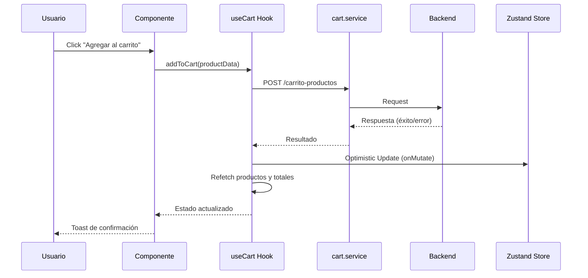
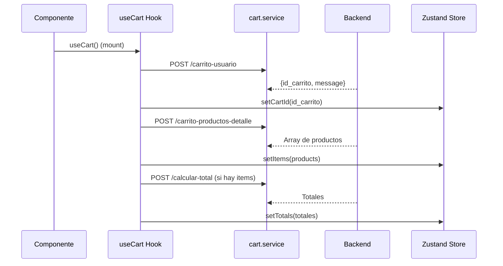
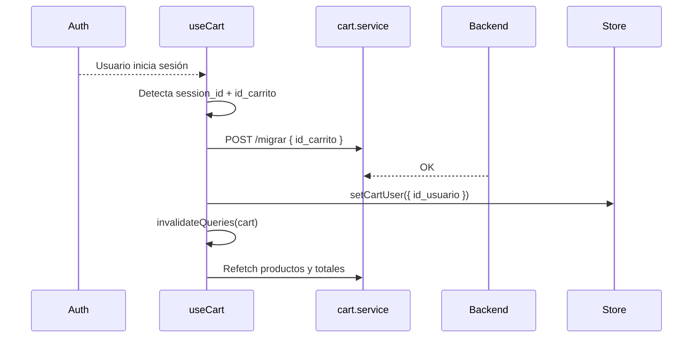

# 🛒 Guía de Integración del Carrito

## 📋 Resumen

Esta guía documenta de forma completa cómo está implementado el sistema de carrito de compras de Revital: arquitectura, responsabilidades por archivo, decisiones técnicas, flujos, manejo de errores y un paso a paso cronológico de la implementación.

## 🏗️ Arquitectura del Sistema

```
┌─────────────────┐    ┌─────────────────┐    ┌──────────────────────┐
│   Components    │    │     Hooks       │    │       Services       │
│                 │    │                 │    │                      │
│ • CartPage      │───▶│ • useCart()     │───▶│ • cart.service.ts    │
│ • CartItem      │    │ • useCartInfo() │    │ • apiWrapper.ts      │
│ • ProductsPage  │    │ • useIsInCart() │    │                      │
│ • ProductCard   │    │                 │    │                      │
└─────────────────┘    └─────────────────┘    └──────────────────────┘
         │                       │                       │
         ▼                       ▼                       ▼
┌─────────────────┐    ┌─────────────────┐    ┌─────────────────┐
│   Zustand       │    │  React Query    │    │     Backend     │
│   Store         │    │    Cache        │    │      API        │
│                 │    │                 │    │                 │
│ • cart-store.ts │    │ • Queries       │    │ • FastAPI       │
│ • Persistencia  │    │ • Mutations     │    │ • PostgreSQL    │
│ • Estado local  │    │ • Invalidation  │    │ • Endpoints     │
└─────────────────┘    └─────────────────┘    └─────────────────┘
```

Puntos clave:

- **Usuarios anónimos y registrados**: soporte nativo mediante `session_id` (UUID v4 string) o `id_usuario`.
- **React Query**: obtención perezosa, `staleTime`, `enabled`, invalidación selectiva y refetch tras mutaciones.
- **Zustand**: estado local, persistencia en `localStorage`, cómputos (totales, conteo), y utilidades (`findItem`).
- **Optimistic UI**: para agregar, actualizar cantidad, eliminar y limpiar carrito, con rollback vía refetch.
- **Límites**: validación de monto máximo del carrito en cliente (`CART_LIMITS.MAX_TOTAL`).
- **Migración automática**: carrito anónimo → usuario autenticado tras login.

## 📁 Archivos y responsabilidades

### Hook: `frontend/hooks/use-cart.ts`

- Orquesta toda la lógica del carrito en el cliente.
- Define claves `CART_KEYS` para React Query.
- Inicializa el usuario del carrito: usa `id_usuario` si existe; si no, genera `session_id` (UUID v4 string) con `cart.service.generateSessionId()` y lo persiste en el store.
- Queries:
  - `getOrCreateCart(cartUser)` → crea/obtiene `id_carrito`.
  - `getCartProductsDetail(cartUser)` → carga productos, sincroniza `items` del store.
  - `calculateCartTotal(cartUser)` → carga `totals` en el store cuando hay items.
- Mutations (con Optimistic UI y validaciones):
  - `addToCart(product)` → valida límite, crea item temporal, refetch de productos y totales.
  - `updateQuantity({ id_carrito_producto, cantidad, stock_disponible })` → valida stock, cantidad > 0 y límite.
  - `removeFromCart(id_carrito_producto)` → quita localmente y refetch.
  - `clearCart()` → elimina todos los ítems en backend, limpia store de forma optimista.
  - `migrateCart({ id_carrito })` → migra carrito anónimo al usuario autenticado tras login.
- Estados expuestos: `items`, `totals`, `itemCount`, `total`, `hasItems`, `isLoading`, `error`, flags de mutación (`isAddingToCart`, etc.).

### Servicio: `frontend/services/cart.service.ts`

- Contratos y DTOs del dominio carrito.
- Constantes: `CART_LIMITS.MAX_TOTAL`.
- `generateSessionId()` para usuarios anónimos.
- Endpoints:
  - `POST /carrito-usuario` → `getOrCreateCart`.
  - `POST /carrito-productos` → `addToCart` (envía `session_id` como query param cuando aplique).
  - `PUT /carrito-productos/{id}` → `updateCartItemQuantity`.
  - `DELETE /carrito-productos/{id}` → `removeFromCart`.
  - `POST /carrito-productos-detalle` → `getCartProductsDetail`.
  - `POST /calcular-total` → `calculateCartTotal`.
  - `POST /migrar` → `migrateAnonymousCart`.

### Store: `frontend/stores/cart-store.ts`

- Estado persistente (`persist` + `localStorage`) con `name: 'revital-cart-storage'`.
- Datos: `items`, `totals`, `id_carrito`, `cartUser`.
- UI: `isLoading`, `error`, `isOpen` y acciones (`openCart`, `closeCart`, `toggleCart`).
- Acciones CRUD: `addItem`, `removeItem`, `updateItemQuantity`, `clearCart`.
- Utilidades: `getItemCount`, `getCartTotal`, `hasItems`, `findItem`.
- Partialize para persistir solo datos significativos (sin estados de UI transitorios).

### API Wrapper: `frontend/utils/apiWrapper.ts`

- Configura Axios con interceptores de request/response.
- Lista blanca de endpoints públicos (carrito incluido) para permitir uso sin token.
- Refresh token automático para rutas privadas y manejo de sesión expirada.
- Métodos HTTP genéricos: `get`, `post`, `put`, `del`, `patch`.

### UI Carrito: `frontend/app/(shop)/cart/page.tsx`

- Página de carrito con estado real bajo `useCart()`.
- Muestra `items`, `totals`, subtotal, envío, impuestos y total final.
- Lógica de actualización de cantidad, eliminación de ítems y feedback de errores relevantes (p.ej. stock insuficiente y límite superado).
- Layout responsivo con sidebar móvil para el resumen.

### Item de Carrito: `frontend/components/cart/cart-item.tsx`

- Componente presentacional con control de cantidad, remover y favorito.
- Valida antes de invocar acciones:
  - Stock según `stock_disponible`.
  - Límite del carrito con `CART_LIMITS.MAX_TOTAL`.
- Prop `cartTotal` permite precalcular si la acción de “+1” excede el límite, deshabilitando el botón y mostrando la razón.

### Productos: `frontend/components/products-page/products-display.tsx`

- Integra `useCart()` para agregar productos desde la grilla/lista.
- Busca el producto en `productsData`, valida `num_stock`, construye `CartProductCreate` y llama a `addToCart`.
- Muestra toasts de éxito/error y mantiene la UI consistente con React Query + Zustand.

### Tarjeta de Producto: `frontend/components/product/product-card.tsx`

- Card visual reutilizable (precio, badge, imagen hover, favorito). Se integra con acciones externas (`onClick`, `onToggleFavorite`).

## 🔄 Flujos de datos

### Agregar producto al carrito



### Carga inicial del carrito



### Migración automática (anónimo → autenticado)



## 📊 Estados del sistema

### Hook `useCart()` (principales)

```typescript
items: CartProductDetail[]
totals: CartTotalResponse | null
itemCount: number
total: number
isLoading: boolean
error: string | null
hasItems: () => boolean
isAddingToCart: boolean
isUpdatingQuantity: boolean
isRemoving: boolean
```

### Store `useCartStore()` (principales)

```typescript
items: CartItem[]
totals: CartTotalResponse | null
id_carrito?: number
isLoading: boolean
error: string | null
cartUser: { id_usuario?: number; session_id?: string }
```

## ✅ Casos de uso

### Funcionando

- **Agregar producto** desde página de producto y grilla/lista.
- **Ver carrito** y resumen con totales reales del backend.
- **Persistencia** entre sesiones con `localStorage`.
- **Usuarios anónimos** con `session_id` automático.
- **Usuarios autenticados** con `id_usuario`.
- **Cálculo de totales** (descuentos, puntos) desde backend.

### Pendientes / siguientes

- **Favoritos** (UI lista, falta backend/integración).
- **Códigos promocionales** (UI lista, falta endpoint/acción).
- **Checkout** (pendiente flujo completo).

## 🔧 Uso para desarrolladores

### 1) Hook completo

```typescript
import { useCart } from "@/hooks/use-cart";

const MyComponent = () => {
  const { addToCart, items, itemCount, isAddingToCart } = useCart();
  const handleAdd = () => {
    addToCart({
      id_categoria_producto: 1,
      id_linea_producto: 1,
      id_sublinea_producto: 1,
      id_producto: 123,
      cantidad: 1,
      precio_unitario_carrito: 29990,
    });
  };
};
```

### 2) Info básica (header)

```typescript
import { useCartInfo } from "@/hooks/use-cart";

const Header = () => {
  const { itemCount, total, isLoading } = useCartInfo();
  return (
    <div>
      Carrito ({itemCount}) - ${total}
    </div>
  );
};
```

### 3) Verificar si un producto está en el carrito

```typescript
import { useIsInCart } from "@/hooks/use-cart";
const ProductComponent = ({ productId }: { productId: number }) => {
  const isInCart = useIsInCart(productId);
  return <div>{isInCart ? "En el carrito" : "Agregar al carrito"}</div>;
};
```

## 🚨 Manejo de errores y validaciones

- **Producto no encontrado**: no se agrega; toast de error.
- **Sin stock**: validación en UI y en `updateQuantity`; mensaje específico.
- **Límite de carrito**: validación previa en `useCart.addToCart` y `updateQuantity`; UI deshabilita “+1” y muestra mensaje.
- **Token expirado**: endpoints de carrito son públicos; rutas privadas usan refresh automático en `apiWrapper`.
- **Optimistic UI fallida**: rollback por refetch de productos/totales en `onError`.

## 🧪 Endpoints implicados (backend)

- `POST /carrito-usuario`
- `POST /carrito-productos`
- `PUT /carrito-productos/{id}`
- `DELETE /carrito-productos/{id}`
- `POST /carrito-productos-detalle`
- `POST /calcular-total`
- `POST /migrar`

## 🧭 Paso a paso cronológico (de 0 a 100)

1. Configuración de cliente HTTP

- Se creó `apiWrapper.ts` con interceptores, endpoints públicos para carrito y refresh de token.

2. Estado global y persistencia

- Se implementó `cart-store.ts` con Zustand, persistencia selectiva, utilidades (conteo, total, búsqueda), y acciones CRUD.

3. Servicio de dominio carrito

- Se definieron tipos, límites (`CART_LIMITS`), y funciones a endpoints en `cart.service.ts`.

4. Hook orquestador

- Se desarrolló `use-cart.ts` con claves de React Query, queries (carrito, productos, totales), migración automática de carrito y mutations con Optimistic UI y validaciones.

5. UI del carrito

- Se creó la página `app/(shop)/cart/page.tsx` consumiendo `useCart()`, con resumen, lista de items y manejo de errores.

6. Ítem de carrito

- `components/cart/cart-item.tsx` con controles de cantidad, validaciones de stock/límite y eliminación.

7. Integración en listado/grilla de productos

- `components/products-page/products-display.tsx` integra `useCart()` para agregar desde la grilla/lista con validaciones y toasts.

8. Tarjeta de producto reutilizable

- `components/product/product-card.tsx` para UI consistente y futura integración con favoritos/quick add.

9. Migración tras login

- El `useCart` detecta autenticación, llama a `migrateAnonymousCart`, invalida queries y sincroniza `cartUser`.

## 📈 Métricas y debug

### Eventos sugeridos

- `cart.product.added`
- `cart.product.removed`
- `cart.quantity.updated`
- `cart.checkout.started`
- `cart.error.occurred`

### Logs de debug

```typescript
// Ejemplos que verás en consola al activar logs propios
// 🛒 Generando session_id para usuario anónimo: 123456
// ✅ Carrito obtenido: { id_carrito: 456 }
// 🛒 Agregando producto al carrito: { id_producto: 789 }
```

---

**Fecha de creación:** 2025-09-17
**Última actualización:** 2025-09-17
**Versión:** 1.1.0
**Autor:** Revital Development Team
