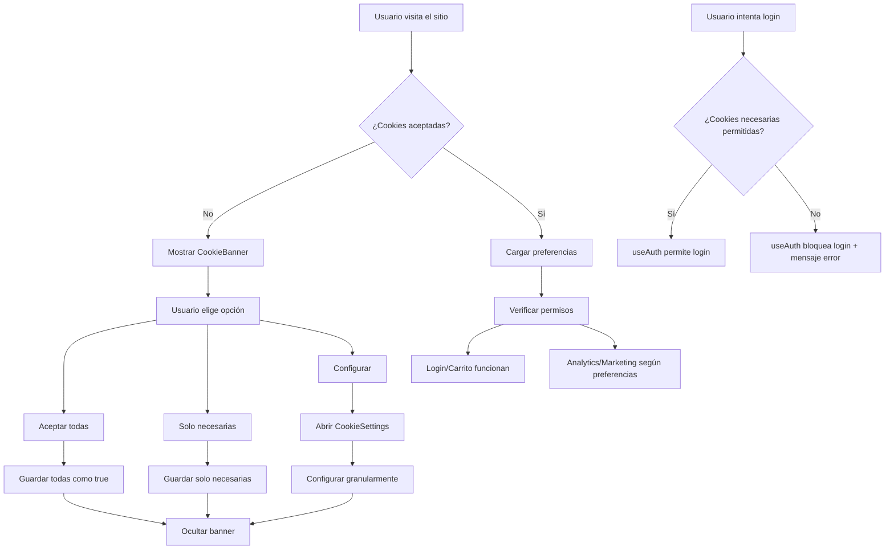

# 🍪 Sistema de Cookies - Revital E-commerce

## 📋 Descripción General

Este sistema de cookies está diseñado para cumplir con las regulaciones de privacidad (GDPR, CCPA) y proporcionar una experiencia de usuario transparente y controlable.

## 🎯 Características Principales

### ✅ **Compliance Legal**
- Banner de consentimiento visible en el home page
- Configuración granular de tipos de cookies
- Opción de revocar consentimiento
- Almacenamiento de preferencias del usuario

### ✅ **Tipos de Cookies Soportados**
1. **Necesarias** - Esenciales para el funcionamiento (login, carrito, etc.)
2. **Funcionales** - Mejoran la experiencia del usuario
3. **Analíticas** - Para análisis y métricas del sitio
4. **Marketing** - Para publicidad personalizada

### ✅ **UX/UI Moderna**
- Banner responsive y accesible
- Modal de configuración detallada
- Integración con el footer
- Soporte para modo oscuro

## 🏗️ Arquitectura del Sistema

### **Componentes Principales**

#### 1. **CookieBanner** (`/components/ui/cookie-banner.tsx`)
- Banner principal que aparece en el home page
- Opciones: "Aceptar todas", "Solo necesarias", "Configurar"
- Vista expandida con configuración detallada
- **Integrado con useCookies hook**

#### 2. **CookieSettings** (`/components/ui/cookie-settings.tsx`)
- Modal de configuración granular
- Switches para cada tipo de cookie
- Opción de revocar consentimiento
- Integrado en el footer

#### 3. **useCookies** (`/hooks/use-cookies.ts`)
- Hook principal para manejar cookies
- Gestión de preferencias en localStorage
- Funciones de aceptar/revocar consentimiento
- **Único hook para gestión de cookies**

#### 4. **useAuth** (`/hooks/use-auth.ts`) ⭐ **CONSOLIDADO**
- Hook principal de autenticación con React Query
- **INCLUYE validación de cookies integrada**
- Login, logout, registro, actualización de perfil
- **Bloquea autenticación si cookies no están permitidas**

### **Flujo de Funcionamiento**



## 🚀 Implementación

### **1. Agregar al Home Page**
```tsx
import { CookieBanner } from "@/components/ui/cookie-banner"

export default function Home() {
  return (
    <div>
      {/* Contenido del home */}
      <CookieBanner />
    </div>
  )
}
```

### **2. Integrar en Footer**
```tsx
import { CookieSettings } from "@/components/ui/cookie-settings"

// En LegalLinks
<div className="flex gap-3">
  {/* Links legales */}
  <CookieSettings />
</div>
```

### **3. Usar en Componentes de Autenticación** ⭐ **ACTUALIZADO**
```tsx
import { useAuth } from "@/hooks/use-auth"

function LoginComponent() {
  const { login, canUseCookies, isLoggingIn } = useAuth()
  
  const handleLogin = async (credentials) => {
    // useAuth ya valida cookies automáticamente
    // No necesitas verificar manualmente
    login(credentials)
  }
  
  return (
    <div>
      {!canUseCookies && (
        <div className="alert alert-warning">
          Debes aceptar las cookies para iniciar sesión
        </div>
      )}
      
      <button 
        onClick={() => handleLogin(credentials)}
        disabled={!canUseCookies || isLoggingIn}
      >
        {isLoggingIn ? 'Iniciando...' : 'Iniciar Sesión'}
      </button>
    </div>
  )
}
```

## 🔧 Configuración

### **Preferencias por Defecto**
```typescript
const defaultPreferences = {
  necessary: true,    // Siempre activas
  functional: false,  // Opcional
  analytics: false,   // Opcional
  marketing: false    // Opcional
}
```

### **Almacenamiento**
- **localStorage**: `cookies-accepted` y `cookies-preferences`
- **Persistencia**: Hasta que el usuario revoque el consentimiento
- **Timestamp**: Para tracking de última actualización

## 📱 Responsive Design

### **Mobile First**
- Banner apilado verticalmente en móviles
- Botones de tamaño táctil apropiado
- Modal optimizado para pantallas pequeñas

### **Desktop**
- Layout horizontal del banner
- Modal de configuración expandido
- Hover states y transiciones suaves

## 🎨 Temas y Estilos

### **Modo Claro**
- Fondo blanco con bordes grises
- Texto oscuro para contraste
- Botones azules para acciones principales

### **Modo Oscuro**
- Fondo gris oscuro
- Texto claro para legibilidad
- Bordes y separadores adaptados

## 🔒 Seguridad y Privacidad

### **Cookies Necesarias**
- **Login**: Tokens JWT para autenticación
- **Carrito**: Productos seleccionados
- **Preferencias**: Configuración del usuario
- **Seguridad**: CSRF tokens, sesiones

### **Cookies Opcionales**
- **Analíticas**: Google Analytics, métricas internas
- **Marketing**: Retargeting, publicidad personalizada
- **Funcionales**: Recordar preferencias, personalización

## 📊 Analytics y Tracking

### **Eventos Rastreados**
- Aceptación de cookies
- Cambios en preferencias
- Revocación de consentimiento
- Tipos de cookies aceptadas

### **Métricas de Compliance**
- Porcentaje de usuarios que aceptan
- Distribución de preferencias
- Tiempo hasta aceptación
- Tasa de revocación

## 🧪 Testing

### **Casos de Prueba**
1. **Primera visita**: Banner visible
2. **Aceptar todas**: Banner desaparece, todas activas
3. **Solo necesarias**: Banner desaparece, solo esenciales
4. **Configurar**: Modal abre, configuración granular
5. **Revocar**: Limpia preferencias, banner reaparece
6. **Login sin cookies**: Bloqueado automáticamente
7. **Login con cookies**: Funciona normalmente

### **Validaciones**
- localStorage se actualiza correctamente
- Preferencias se aplican en tiempo real
- Banner no aparece después de aceptar
- Configuración persiste entre sesiones
- **Autenticación bloqueada sin cookies necesarias**

## 🚨 Consideraciones Legales

### **GDPR Compliance**
- Consentimiento explícito antes de cookies no esenciales
- Derecho a retirar consentimiento
- Información clara sobre cada tipo de cookie
- Base legal para el procesamiento

### **CCPA Compliance**
- Notificación de venta de datos personales
- Derecho a opt-out
- Transparencia en el uso de cookies
- Mecanismos de ejercicio de derechos

## 🔮 Futuras Mejoras

### **Funcionalidades Planificadas**
- [ ] Integración con Google Tag Manager
- [ ] Banner de cookies por país/región
- [ ] A/B testing de mensajes del banner
- [ ] Analytics de compliance en tiempo real
- [ ] Integración con sistemas de consentimiento externos

### **Optimizaciones Técnicas**
- [ ] Lazy loading del banner
- [ ] Cache de preferencias en Redis
- [ ] API endpoints para gestión de cookies
- [ ] Webhook para cambios de consentimiento

## 📚 Recursos Adicionales

### **Documentación Legal**
- [GDPR Cookie Consent](https://gdpr.eu/cookies/)
- [CCPA Requirements](https://oag.ca.gov/privacy/ccpa)
- [Cookie Law Guidelines](https://www.cookielawinfo.com/)

### **Herramientas de Testing**
- [Cookie Consent Checker](https://www.cookiebot.com/en/cookie-checker/)
- [GDPR Compliance Tool](https://gdpr.eu/)
- [Privacy Policy Generator](https://www.privacypolicygenerator.info/)

---

## ⭐ **Cambios Recientes - Consolidación de Hooks**

### **Antes (3 hooks separados):**
- `useCookies` - Solo gestión de cookies
- `useAuthCookies` - Autenticación + cookies (duplicado)
- `useAuth` - Autenticación completa (sin validación de cookies)

### **Ahora (2 hooks consolidados):**
- `useCookies` - Solo gestión de cookies
- `useAuth` - Autenticación completa **+ validación de cookies integrada**

### **Beneficios de la consolidación:**
- ✅ **Menos duplicación** de código
- ✅ **Mejor integración** entre autenticación y cookies
- ✅ **React Query** para cache y estado eficiente
- ✅ **Validación automática** de cookies en todas las operaciones de auth
- ✅ **Mantenimiento más simple** con menos archivos

**Nota**: Este sistema está diseñado para cumplir con las regulaciones actuales, pero se recomienda consultar con un abogado especializado en privacidad para asegurar el cumplimiento completo en tu jurisdicción específica.
