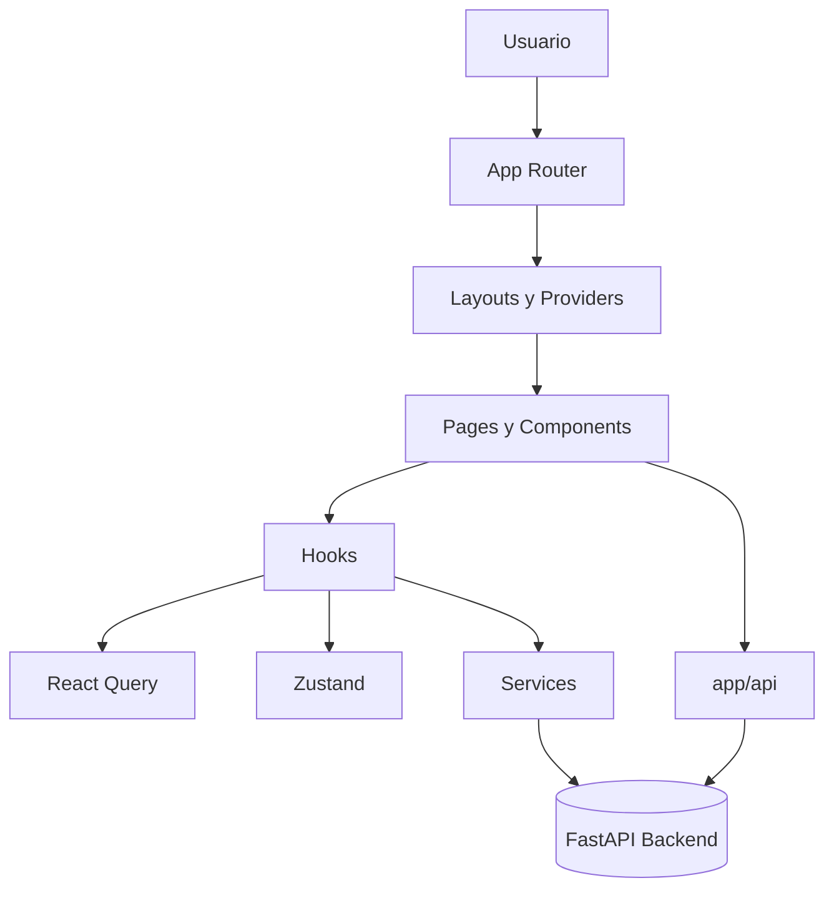

# Frontend Technical Overview

## Objetivo
Este documento describe tecnicamente el frontend de `revital_ecommerce`, carpeta por carpeta y archivo por archivo, para facilitar onboarding, mantenimiento y exploracion funcional del proyecto.

## Contexto arquitectonico
`revital_ecommerce/frontend` es una aplicacion Next.js con App Router, React 19, TypeScript, Tailwind y un design system basado en shadcn/ui. La app se organiza en capas relativamente claras:

- `app/`: rutas, layouts y route handlers.
- `components/`: UI reusable y modulos de negocio.
- `hooks/`: acceso declarativo a estado, cache y comportamiento cliente.
- `services/`: comunicacion con el backend FastAPI.
- `types/` y `schemas/`: contratos de tipos TypeScript y validacion Zod.
- `stores/`: estado global persistido con Zustand.
- `utils/` y `lib/`: helpers, normalizadores y configuracion runtime.
- `providers/`: wrappers globales para auth, tema y React Query.

## Flujo general

## Raiz del frontend

### Carpetas principales
- `app/`: App Router, pages, layouts y proxies server-side.
- `components/`: componentes UI, layout, formularios y modulos de negocio.
- `providers/`: wrappers de contexto de alto nivel.
- `hooks/`: hooks cliente y hooks de React Query.
- `services/`: integracion HTTP con la API.
- `stores/`: estado global con Zustand.
- `types/`: tipos TS del dominio.
- `schemas/`: validacion Zod de formularios y payloads.
- `utils/`: utilidades puras y wrappers de infraestructura cliente.
- `lib/`: configuraciones y helpers de dominio.
- `Docs/`: documentacion tecnica interna del frontend.
- `public/`: assets estaticos.
- `.next/`: artefactos generados de desarrollo/build; no forma parte del codigo fuente.

### Archivos de raiz
- `package.json`: define el proyecto Next 16 + React 19, dependencias clave como React Query, Zustand, Zod, Radix, Sonner y scripts `dev`, `build`, `start`, `lint`, `verify-api`.
- `next.config.ts`: configura Next, `remotePatterns` para imagenes, cabeceras de seguridad/CSP y ajustes de build/servidor.
- `tailwind.config.ts`: extiende Tailwind con tokens de color, branding y configuracion `darkMode: "class"`.
- `tsconfig.json`: activa TypeScript estricto, resolucion `bundler` y alias `@/*`.
- `components.json`: configura shadcn/ui con aliases y estilo base del proyecto.
- `next-env.d.ts`: archivo generado por Next para tipos globales del framework.
- `.env.development.example`: ejemplo minimo de variables publicas para desarrollo.
- `.env.production.example`: ejemplo minimo de variables publicas para produccion.
- `.env.development`: configuracion local de desarrollo; no debe tomarse como documentacion funcional.
- `.env.production`: configuracion local/productiva real del entorno; contiene runtime config y no debe exponerse.

## `app/`
La carpeta `app/` concentra la composicion principal de la aplicacion bajo App Router.

### Archivos raiz de `app/`
- `app/layout.tsx`: layout raiz que monta fuentes Geist, `QueryProvider`, autenticacion, tema, refresh de token y `Toaster`.
- `app/loading.tsx`: fallback global de carga reutilizable para transiciones y esperas de rutas.
- `app/not-found.tsx`: pagina 404 global con layout de tienda y CTA de navegacion.
- `app/robots.ts`: genera `robots` y `sitemap` usando la URL publica configurada.
- `app/globals.css`: tokens globales, dark mode, utilidades visuales y ajustes de componentes base.

### `app/(auth)/`
- `app/(auth)/login/page.tsx`: pagina de login con redireccion automatica si ya existe sesion valida.
- `app/(auth)/register/page.tsx`: pagina de registro con control de hidratacion y redireccion por rol.
- `app/(auth)/forgot-password/page.tsx`: vista publica para solicitar recuperacion de contrasena.
- `app/(auth)/reset-password/page.tsx`: flujo de reseteo basado en parametros de URL, montado bajo `Suspense`.
- `app/(auth)/verify-email/page.tsx`: pagina de verificacion de email por token/OTP bajo `Suspense`.

### `app/(shop)/`
- `app/(shop)/layout.tsx`: layout publico de tienda con `TopInfoBar`, header, footer y redireccion silenciosa de admins al panel.
- `app/(shop)/page.tsx`: home publica que compone hero, categorias, destacados, testimonios, cookies y chatbot.
- `app/(shop)/home-sections.client.tsx`: carga dinamica de secciones pesadas de la home sin SSR.
- `app/(shop)/ShopAuthRedirect.tsx`: redirige admins autenticados fuera del storefront hacia `/admin`.
- `app/(shop)/blog/page.tsx`: landing estatica de blog con posts mock.
- `app/(shop)/contacto/page.tsx`: pagina estatica de contacto con datos y CTA.
- `app/(shop)/ayuda/page.tsx`: centro de ayuda publico con FAQs mock.
- `app/(shop)/nosotros/page.tsx`: pagina institucional con contenido corporativo.
- `app/(shop)/seguimiento/page.tsx`: guia publica de seguimiento de pedidos, aun sin tracking real embebido.
- `app/(shop)/discounts/page.tsx`: lista descuentos activos usando hooks del dominio de descuentos.
- `app/(shop)/favorites/page.tsx`: wishlist/favoritos del usuario autenticado con estados de carga y vacio.
- `app/(shop)/profile/page.tsx`: perfil del cliente con tabs sincronizadas por querystring.
- `app/(shop)/accesibilidad/page.tsx`: pagina legal/informativa de accesibilidad.
- `app/(shop)/cookies/page.tsx`: politica de cookies publica.
- `app/(shop)/devoluciones/page.tsx`: informacion estatica del flujo de devoluciones.
- `app/(shop)/inversionistas/page.tsx`: pagina institucional para inversionistas.
- `app/(shop)/prensa/page.tsx`: sala de prensa con contenido mock.
- `app/(shop)/privacidad/page.tsx`: politica de privacidad enfocada en tratamiento de datos.
- `app/(shop)/terminos/page.tsx`: terminos y condiciones construidos desde contenido centralizado del chatbot.

### `app/(shop)/products/`
- `app/(shop)/products/page.tsx`: catalogo principal con filtros, ordenamiento, paginacion y metricas de filtros.

### `app/(shop)/products/[id]/`
- `app/(shop)/products/[id]/page.tsx`: PDP completo con variantes, galeria, stock, descuentos, reviews y productos relacionados.

### `app/(shop)/categories/`
- `app/(shop)/categories/page.tsx`: listado de categorias raiz con conteo recursivo y paginacion cliente.

### `app/(shop)/categories/[id_category]/`
- `app/(shop)/categories/[id_category]/page.tsx`: navegacion jerarquica categoria/linea/sublinea y render del nivel terminal.

### `app/(shop)/cart/`
- `app/(shop)/cart/page.tsx`: carrito rico con descuentos automaticos, cupones, puntos, recomendaciones y preparacion de checkout.

### `app/(shop)/checkout/`
- `app/(shop)/checkout/page.tsx`: checkout autenticado por pasos que consolida direccion, descuentos, puntos y datos para Wompi.

### `app/(shop)/checkout/payment-result/`
- `app/(shop)/checkout/payment-result/page.tsx`: callback post-pago con confirmacion, polling y redireccion a la orden materializada.

### `app/(shop)/profile/orders/[id]/`
- `app/(shop)/profile/orders/[id]/page.tsx`: detalle de una orden del cliente con items, descuentos y totales.

### `app/(dashboard)/admin/`
- `app/(dashboard)/admin/layout.tsx`: layout privado del panel con `AdminGuard`, sidebar, header y provider de tours.
- `app/(dashboard)/admin/page.tsx`: dashboard principal con KPIs, charts, ordenes recientes y resumen IA.
- `app/(dashboard)/admin/not-found.tsx`: 404 interno del panel con accesos rapidos a modulos administrativos.

### `app/(dashboard)/admin/_tour/`
- `app/(dashboard)/admin/_tour/useAdminDriverTour.tsx`: centraliza tours guiados del panel con `driver.js`.

### `app/(dashboard)/admin/account/`
- `app/(dashboard)/admin/account/page.tsx`: cuenta del administrador con flujo de cambio de contrasena.

### `app/(dashboard)/admin/analytics/`
- `app/(dashboard)/admin/analytics/page.tsx`: panel de analytics avanzados por tabs URL-driven.

### `app/(dashboard)/admin/attributes/`
- `app/(dashboard)/admin/attributes/page.tsx`: CRUD de atributos de producto con filtros y tabla.

### `app/(dashboard)/admin/attributes/[id]/values/`
- `app/(dashboard)/admin/attributes/[id]/values/page.tsx`: gestion de valores predefinidos del atributo, incluyendo color HEX y orden visual.

### `app/(dashboard)/admin/brands/`
- `app/(dashboard)/admin/brands/page.tsx`: catalogo administrativo de marcas con filtros, detalle lateral y cambios de estado.

### `app/(dashboard)/admin/categories/`
- `app/(dashboard)/admin/categories/page.tsx`: gestion jerarquica de categoria/linea/sublinea con tabs sincronizadas a la URL.

### `app/(dashboard)/admin/discounts/`
- `app/(dashboard)/admin/discounts/page.tsx`: modulo de descuentos con stats, filtros, modales de edicion y gestion de canjes.

### `app/(dashboard)/admin/discounts/create/`
- `app/(dashboard)/admin/discounts/create/page.tsx`: pagina legacy para crear descuentos mediante formulario completo.

### `app/(dashboard)/admin/discounts/[id]/edit/`
- `app/(dashboard)/admin/discounts/[id]/edit/page.tsx`: pagina legacy de edicion de descuentos basada en `id`.

### `app/(dashboard)/admin/info-bar/`
- `app/(dashboard)/admin/info-bar/page.tsx`: configuracion de la barra superior publica con mensaje HTML sanitizado, CTA, colores y vigencia.

### `app/(dashboard)/admin/lines/`
- `app/(dashboard)/admin/lines/page.tsx`: redireccion a categorias porque la gestion independiente de lineas ya no se usa.

### `app/(dashboard)/admin/orders/`
- `app/(dashboard)/admin/orders/page.tsx`: listado admin de ordenes con filtros, stats y paginacion.

### `app/(dashboard)/admin/orders/[id]/`
- `app/(dashboard)/admin/orders/[id]/page.tsx`: detalle administrativo de la orden con cambio de estado y revision de descuentos/productos.

### `app/(dashboard)/admin/points/`
- `app/(dashboard)/admin/points/page.tsx`: modulo del sistema de puntos con configuracion y listado de usuarios con balances.

### `app/(dashboard)/admin/points/[id]/`
- `app/(dashboard)/admin/points/[id]/page.tsx`: historial de movimientos de puntos por usuario.

### `app/(dashboard)/admin/products/`
- `app/(dashboard)/admin/products/page.tsx`: listado admin de productos con filtros URL-driven, paginacion y drawer de detalle.

### `app/(dashboard)/admin/products/create/`
- `app/(dashboard)/admin/products/create/page.tsx`: flujo de creacion compuesta de producto con variantes e imagenes.

### `app/(dashboard)/admin/products/[id]/`
- `app/(dashboard)/admin/products/[id]/page.tsx`: placeholder sin implementacion real para detalle admin del producto.

### `app/(dashboard)/admin/products/[id]/edit/`
- `app/(dashboard)/admin/products/[id]/edit/page.tsx`: carga el detalle compuesto y permite actualizar el producto e imagenes.

### `app/(dashboard)/admin/providers/`
- `app/(dashboard)/admin/providers/page.tsx`: catalogo admin de proveedores con CRUD modal, filtros y detalle lateral.

### `app/(dashboard)/admin/sublines/`
- `app/(dashboard)/admin/sublines/page.tsx`: redireccion a categorias porque sublineas ya no se gestionan aparte.

### `app/(dashboard)/admin/users/`
- `app/(dashboard)/admin/users/page.tsx`: gestion de usuarios con resumen por rol/estado y modales de edicion.

### `app/api/payments/`
- `app/api/payments/create/route.ts`: proxy server-side para crear pagos en el backend preservando auth y `x-store-id`.
- `app/api/payments/status/route.ts`: proxy GET para consultar estado de pago por referencia.
- `app/api/payments/reattempt/route.ts`: proxy POST para reintentar un pago existente.
- `app/api/payments/poll/route.ts`: polling server-side de una referencia de pago activa.
- `app/api/payments/confirm-checkout/route.ts`: proxy de confirmacion final para materializar la orden.
- `app/api/payments/create-checkout/route.ts`: proxy POST para crear sesiones de checkout Wompi.
- `app/api/payments/order-by-reference/route.ts`: busca la orden asociada a una referencia de pago.
- `app/api/payments/attach-transaction/route.ts`: adjunta un `transaction_id` a una referencia existente.

## `components/`
La carpeta `components/` agrupa tanto primitives de UI como componentes del dominio ecommerce/admin.

### Archivos raiz
- `components/index.ts`: barrel principal que reexporta navegacion, cards y el paquete `ui`.
- `components/PayButton.tsx`: orquesta el flujo cliente de pago con Wompi, consulta estado final y adjunta `transaction_id`.

## `components/admin/`

### Raiz
- `components/admin/ai-chat-panel.tsx`: panel lateral con streaming de respuestas IA e invalidacion de cache por entidades afectadas.
- `components/admin/admin-chat-trigger.tsx`: trigger condicional que habilita el panel IA tras healthcheck.
- `components/admin/catalog-header.tsx`: header reutilizable para vistas de catalogo admin.
- `components/admin/color-picker.tsx`: wrapper de selector de color con preview, popover e input libre.
- `components/admin/data-table.tsx`: placeholder minimo de tabla administrativa.
- `components/admin/empty-states.tsx`: estados vacios reutilizables con icono y acciones.

### `components/admin/common/`
- `components/admin/common/create-entity-modal.tsx`: modal generico para altas CRUD.
- `components/admin/common/edit-entity-modal.tsx`: modal generico para edicion CRUD.

### `components/admin/brands/`
- `components/admin/brands/brands-filters.tsx`: filtros de busqueda y orden para marcas.

### `components/admin/categories/`
- `components/admin/categories/categories-filters.tsx`: filtros de categorias para tablas/listados.
- `components/admin/categories/category-modal.tsx`: modal de creacion/edicion de categorias.

### `components/admin/discounts/`
- `components/admin/discounts/create-discount-modal.tsx`: modal de alta de descuentos con reglas comerciales.
- `components/admin/discounts/discount-columns.tsx`: columnas de TanStack Table y acciones del listado de descuentos.
- `components/admin/discounts/discount-exchanges-modal.tsx`: modal para revisar canjes asociados.
- `components/admin/discounts/discount-filters.tsx`: filtros locales por busqueda, tipo y orden.
- `components/admin/discounts/discount-stats-cards.tsx`: tarjetas KPI del modulo de descuentos.
- `components/admin/discounts/edit-discount-modal.tsx`: modal de edicion de descuentos.
- `components/admin/discounts/use-discount-data.tsx`: hook local para obtener y ordenar descuentos.

### `components/admin/lines/`
- `components/admin/lines/lines-filters.tsx`: filtros de lineas/sublineas en catalogo admin.

### `components/admin/orders/`
- `components/admin/orders/order-detail-cards.tsx`: cards de detalle de una orden.
- `components/admin/orders/order-filters.tsx`: filtros por estado, fecha y busqueda.
- `components/admin/orders/order-stats-cards.tsx`: KPIs de ordenes para backoffice.
- `components/admin/orders/order-status-badge.tsx`: badge visual estandarizado para estado de orden.

### `components/admin/points/`
- `components/admin/points/create-points-config-modal.tsx`: modal para configurar acumulacion/canje de puntos.
- `components/admin/points/points-stats-cards.tsx`: tarjetas de metricas del sistema de puntos.
- `components/admin/points/user-points-history-modal.tsx`: modal de historial de puntos por usuario.

### `components/admin/products/`
- `components/admin/products/all-variant-images-list.tsx`: lista consolidada de imagenes de variantes.
- `components/admin/products/attribute-value-select.tsx`: selector tipado de valores de atributo.
- `components/admin/products/index.ts`: barrel del modulo de productos admin.
- `components/admin/products/pagination.tsx`: paginador administrativo para productos.
- `components/admin/products/product-card.tsx`: card resumida de producto para backoffice.
- `components/admin/products/product-create-header.tsx`: header especifico de pantalla de creacion.
- `components/admin/products/product-form-composite.tsx`: ensamblador del formulario compuesto de producto.
- `components/admin/products/product-form.tsx`: formulario principal de producto.
- `components/admin/products/product-image-upload.tsx`: subida y preview de imagenes principales.
- `components/admin/products/products-filters.tsx`: filtros admin de productos.
- `components/admin/products/products-grid.tsx`: grid/listado visual de productos.
- `components/admin/products/products-header.tsx`: cabecera del modulo de productos.
- `components/admin/products/unified-product-images-panel.tsx`: panel unificado de imagenes de producto y variantes.
- `components/admin/products/variant-image-upload.tsx`: carga de imagenes por variante.
- `components/admin/products/variant-images-carousel.tsx`: carrusel de revision de imagenes por variante.

### `components/admin/providers/`
- `components/admin/providers/providers-filters.tsx`: filtros administrativos de proveedores.

### `components/admin/color-picker/`
- `components/admin/color-picker/ColorArea.tsx`: superficie para ajustar saturacion y brillo.
- `components/admin/color-picker/ColorField.tsx`: campo controlado para editar el valor textual del color.
- `components/admin/color-picker/ColorSlider.tsx`: slider para canales como `hue`.
- `components/admin/color-picker/ColorSwatch.tsx`: swatch de preview del color activo.
- `components/admin/color-picker/Dialog.tsx`: dialog accesible del selector de color.
- `components/admin/color-picker/Popover.tsx`: popover del picker.
- `components/admin/color-picker/color-picker.css`: estilos del submodulo de color picker.
- `components/admin/color-picker/index.ts`: barrel del color picker.

## `components/auth/`
- `components/auth/auth-modal.tsx`: dialog de autenticacion que preserva la ruta destino.
- `components/auth/route-guard.tsx`: guards cliente para auth y rol (`AdminGuard`, `ClientGuard`, `AuthGuard`).

## `components/cart/`
- `components/cart/cart-item.tsx`: representa una linea del carrito con acciones y datos del producto.
- `components/cart/minicart-hover.tsx`: mini carrito flotante mostrado en hover.

## `components/cards/`
- `components/cards/CategoryCard.tsx`: card navegable de categoria con contador y variantes visuales.
- `components/cards/ProductCard.tsx`: card de producto con galeria, precio y disponibilidad.

## `components/chatbot-widget/`
- `components/chatbot-widget/admin-chatbot.tsx`: vista completa del chatbot administrativo con respuestas simuladas y tarjetas de metricas.
- `components/chatbot-widget/admin-chatbot-widget.tsx`: widget flotante del chatbot admin.
- `components/chatbot-widget/chatbot-menu-content.ts`: catalogo de textos legales/comerciales y helpers del chatbot informativo.
- `components/chatbot-widget/customer-chatbot.tsx`: pagina completa de chatbot para clientes con respuestas mock.
- `components/chatbot-widget/customer-chatbot-widget.tsx`: widget flotante del chatbot para clientes.
- `components/chatbot-widget/informative-chatbot-widget.tsx`: widget guiado por menu numerico que mezcla contenido estatico y datos vivos.

## `components/dashboard/`
- `components/dashboard/README.md`: explica la modularizacion interna del dashboard.
- `components/dashboard/best-sellers.tsx`: ranking de productos mas vendidos.
- `components/dashboard/dashboard-header.tsx`: header con rango temporal y refresh.
- `components/dashboard/index.ts`: barrel del dashboard.
- `components/dashboard/kpi-card.tsx`: tarjeta KPI con valor, tendencia y loading.
- `components/dashboard/loading-skeleton.tsx`: skeleton compuesto del dashboard.
- `components/dashboard/recent-orders.tsx`: listado responsive de ordenes recientes.
- `components/dashboard/sales-chart.tsx`: grafico de ventas y resumen temporal.

## `components/forms/`
- `components/forms/forgot-password.tsx`: formulario para iniciar recuperacion de contrasena.
- `components/forms/index.ts`: barrel de formularios de autenticacion.
- `components/forms/login-form.tsx`: formulario de login.
- `components/forms/register-form.tsx`: formulario de registro de cliente.
- `components/forms/reset-password.tsx`: formulario para establecer nueva contrasena.
- `components/forms/verify-email-form.tsx`: formulario para verificar el email y activar la cuenta.

## `components/layout/dashboard/`
- `components/layout/dashboard/admin-header.tsx`: header del dashboard admin.
- `components/layout/dashboard/nav-main.tsx`: navegacion principal del panel.
- `components/layout/dashboard/nav-secondary.tsx`: navegacion secundaria del panel.
- `components/layout/dashboard/nav-user.tsx`: menu del usuario autenticado en backoffice.
- `components/layout/dashboard/sidebar.tsx`: sidebar lateral del panel administrativo.

## `components/layout/shop/`
- `components/layout/shop/top-info-bar.tsx`: barra informativa superior publica.

### `components/layout/shop/categories/`
- `components/layout/shop/categories/categories.tsx`: seccion de categorias destacadas del storefront.

### `components/layout/shop/featured-categories/`
- `components/layout/shop/featured-categories/featured-categories.tsx`: bloque de categorias destacadas con fetch/render.
- `components/layout/shop/featured-categories/featured-categories-error.tsx`: fallback visual ante error de carga.
- `components/layout/shop/featured-categories/featured-categories-skeleton.tsx`: skeleton de carga de la seccion.

### `components/layout/shop/featured-products/`
- `components/layout/shop/featured-products/featured-products.tsx`: seccion compleja de productos destacados con estados y filtros.

### `components/layout/shop/footer/`
- `components/layout/shop/footer/README.md`: documenta la atomizacion del footer.
- `components/layout/shop/footer/footer.tsx`: footer principal que ensambla bloques legales, corporativos y promocionales.

### `components/layout/shop/footer/components/`
- `components/layout/shop/footer/components/about-section.tsx`: seccion de empresa/contacto.
- `components/layout/shop/footer/components/categories-section.tsx`: bloque de enlaces categorizados.
- `components/layout/shop/footer/components/copyright-section.tsx`: pie legal/copyright.
- `components/layout/shop/footer/components/features-section.tsx`: lista de beneficios/servicios.
- `components/layout/shop/footer/components/index.ts`: barrel de piezas del footer.
- `components/layout/shop/footer/components/legal-links.tsx`: enlaces a paginas legales.
- `components/layout/shop/footer/components/newsletter-section.tsx`: CTA de newsletter.
- `components/layout/shop/footer/components/payment-methods.tsx`: representacion visual de medios de pago.
- `components/layout/shop/footer/components/social-section.tsx`: enlaces a redes sociales.

### `components/layout/shop/header/`
- `components/layout/shop/header/header.tsx`: header principal de la tienda.

### `components/layout/shop/header/components/`
- `components/layout/shop/header/components/cart-button.tsx`: boton del carrito con contador y acceso rapido.
- `components/layout/shop/header/components/chevron-icon.tsx`: icono auxiliar para estados expandibles.
- `components/layout/shop/header/components/index.ts`: barrel del header.
- `components/layout/shop/header/components/mobile-menu.tsx`: menu movil colapsable.
- `components/layout/shop/header/components/navigation.tsx`: navegacion principal del storefront.
- `components/layout/shop/header/components/product-search-bar.tsx`: buscador enfocado a catalogo/productos.
- `components/layout/shop/header/components/search-bar.tsx`: input de busqueda generico reutilizable.
- `components/layout/shop/header/components/theme-toggle.tsx`: toggle de tema claro/oscuro.
- `components/layout/shop/header/components/user-menu.tsx`: menu contextual del usuario autenticado.

### `components/layout/shop/hero/`
- `components/layout/shop/hero/README.md`: documenta la atomizacion del hero carousel.
- `components/layout/shop/hero/hero.tsx`: hero carousel principal de la homepage.

### `components/layout/shop/hero/components/`
- `components/layout/shop/hero/components/bg-decorative-elements.tsx`: elementos decorativos de fondo del hero.
- `components/layout/shop/hero/components/index.ts`: barrel del hero.
- `components/layout/shop/hero/components/navigation-buttons.tsx`: controles prev/next del carousel.
- `components/layout/shop/hero/components/product-actions.tsx`: CTAs del slide.
- `components/layout/shop/hero/components/product-badge.tsx`: badge de oferta/estado del slide.
- `components/layout/shop/hero/components/product-counter.tsx`: indicador `X / Y` de posicion.
- `components/layout/shop/hero/components/product-features.tsx`: lista de features del producto destacado.
- `components/layout/shop/hero/components/product-image.tsx`: imagen principal del slide.
- `components/layout/shop/hero/components/product-info.tsx`: nombre, copy y subtitulo del slide.
- `components/layout/shop/hero/components/product-pricing.tsx`: precio actual, anterior y ahorro.
- `components/layout/shop/hero/components/product-thumbnails.tsx`: miniaturas seleccionables.
- `components/layout/shop/hero/components/slide-indicators.tsx`: indicadores de slide con navegacion directa.

### `components/layout/shop/new-drops/`
- `components/layout/shop/new-drops/new-drops.tsx`: seccion promocional para novedades/lanzamientos.

### `components/layout/shop/profile/`
- `components/layout/shop/profile/README.md`: documenta la descomposicion del perfil en tabs.
- `components/layout/shop/profile/add-payment-method-dialog.tsx`: dialog para registrar un nuevo metodo de pago.
- `components/layout/shop/profile/addresses-tab.tsx`: tab de direcciones de envio.
- `components/layout/shop/profile/avatar-tab.tsx`: tab de avatar/perfil visual.
- `components/layout/shop/profile/exchange-tab.tsx`: tab de canjes/beneficios.
- `components/layout/shop/profile/index.ts`: barrel del modulo de perfil.
- `components/layout/shop/profile/orders-tab.tsx`: historial de pedidos del usuario.
- `components/layout/shop/profile/payment-tab.tsx`: gestion de medios de pago guardados.
- `components/layout/shop/profile/profile-header.tsx`: header del perfil.
- `components/layout/shop/profile/profile-tab.tsx`: formulario de datos personales.
- `components/layout/shop/profile/settings-tab.tsx`: configuraciones y preferencias de cuenta.
- `components/layout/shop/profile/wishlist-tab.tsx`: tab de favoritos/lista de deseos.

### `components/layout/shop/testimonials/`
- `components/layout/shop/testimonials/testimonials.tsx`: seccion publica de testimonios/reseñas.

## `components/navigation/`
- `components/navigation/HierarchicalNavigation.tsx`: breadcrumb con boton de volver y soporte jerarquico.

## `components/payment/`
- `components/payment/payment-card-brands.tsx`: logos y compatibilidades de tarjetas.
- `components/payment/wompi-modal.tsx`: modal generico para interacciones con Wompi.
- `components/payment/wompi-payment-modal.tsx`: modal especializado del checkout Wompi.
- `components/payment/wompi-troubleshoot-guide.tsx`: guia visual de diagnostico para fallos de pago.
- `components/payment/wompi-widget.tsx`: encapsula el widget embebido oficial de Wompi.

## `components/product/`
- `components/product/index.ts`: barrel del modulo de producto.
- `components/product/product-card.tsx`: card de producto para listados.
- `components/product/product-filters.tsx`: filtros de producto por atributos/comercio.
- `components/product/product-gallery.tsx`: galeria del detalle de producto.
- `components/product/product-grid.tsx`: grid responsive de productos.
- `components/product/product-info.tsx`: panel de informacion comercial del producto.
- `components/product/product-list.tsx`: variante en listado lineal.
- `components/product/product-variant-selector.tsx`: selector de variantes/SKU.
- `components/product/related-products.tsx`: recomendaciones relacionadas.

## `components/products-page/`
- `components/products-page/index.ts`: barrel de la pagina de productos.
- `components/products-page/products-display.tsx`: coordinador del render del listado.
- `components/products-page/products-filters.tsx`: UI de filtros de la pagina de catalogo.
- `components/products-page/products-header.tsx`: cabecera con conteos y ordenamiento.
- `components/products-page/products-pagination.tsx`: paginador del catalogo publico.

## `components/providers/`
- `components/providers/refresh-token-provider.tsx`: provider sin UI que restaura sesion y programa refresh periodico.

## `components/tables/`
- `components/tables/table.tsx`: tabla generica basada en TanStack Table.

## `components/ui/`
- `components/ui/UNIVERSAL_FILTERS_GUIDE.md`: guia funcional del sistema de filtros universales.
- `components/ui/accordion.tsx`: wrapper colapsable tipo acordeon.
- `components/ui/alert-dialog.tsx`: modal de confirmacion destructiva accesible.
- `components/ui/alert.tsx`: alerta contextual con variantes semanticas.
- `components/ui/aspect-ratio.tsx`: preserva relaciones de aspecto.
- `components/ui/avatar-selector.tsx`: selector visual de avatar.
- `components/ui/avatar.tsx`: primitive de avatar con fallback.
- `components/ui/badge.tsx`: badge tipado con variantes visuales.
- `components/ui/breadcrumb.tsx`: breadcrumbs accesibles.
- `components/ui/button.tsx`: boton base del design system.
- `components/ui/calendar.tsx`: calendario reusable.
- `components/ui/card.tsx`: primitive de card.
- `components/ui/cart-toast.tsx`: toast especializado del carrito.
- `components/ui/checkbox.tsx`: checkbox accesible.
- `components/ui/collapsible.tsx`: contenedor expandible/colapsable.
- `components/ui/command.tsx`: command palette/listado de acciones.
- `components/ui/context-menu.tsx`: menu contextual accesible.
- `components/ui/cookie-banner.tsx`: banner de consentimiento de cookies.
- `components/ui/cookie-settings.tsx`: dialog de preferencias de cookies.
- `components/ui/dialog.tsx`: modal base reusable.
- `components/ui/drawer.tsx`: drawer para overlays.
- `components/ui/dropdown-menu.tsx`: menu desplegable accesible.
- `components/ui/empty-state.tsx`: estado vacio reusable.
- `components/ui/filter-suggestions.tsx`: chips y acciones de filtros activos.
- `components/ui/form.tsx`: integracion de formularios con helpers de campo.
- `components/ui/hover-card.tsx`: card emergente en hover.
- `components/ui/illustrations.tsx`: ilustraciones SVG para estados vacios/error.
- `components/ui/index.ts`: barrel del kit `ui`.
- `components/ui/input-otp.tsx`: primitive para OTP segmentado.
- `components/ui/input.tsx`: input base estilizado.
- `components/ui/interactive-hover-button.tsx`: boton con microinteracciones de hover.
- `components/ui/label.tsx`: label accesible.
- `components/ui/loading.tsx`: loader configurable.
- `components/ui/menubar.tsx`: menubar tipo desktop.
- `components/ui/navigation-menu.tsx`: primitive de navegacion expansible.
- `components/ui/no-ssr.tsx`: gate cliente que evita render SSR.
- `components/ui/pagination.tsx`: primitive visual de paginacion.
- `components/ui/password-strength.tsx`: input con scoring de fortaleza de contrasena.
- `components/ui/popover.tsx`: popover reusable.
- `components/ui/progress.tsx`: barra de progreso.
- `components/ui/radio-group.tsx`: grupo de radios accesible.
- `components/ui/review-form.tsx`: formulario para enviar reseñas.
- `components/ui/reviews-section.tsx`: seccion de comentarios/reseñas con React Query.
- `components/ui/rotating-text.css`: estilos del texto rotatorio.
- `components/ui/rotating-text.tsx`: texto animado que rota mensajes.
- `components/ui/scroll-area.tsx`: area de scroll custom.
- `components/ui/select.tsx`: select accesible.
- `components/ui/separator.tsx`: separador horizontal/vertical.
- `components/ui/sheet.tsx`: sheet lateral reusable.
- `components/ui/sidebar.tsx`: primitive de sidebar.
- `components/ui/skeleton.tsx`: placeholders animados de carga.
- `components/ui/slider.tsx`: slider accesible.
- `components/ui/sonner.tsx`: integracion del toaster `sonner`.
- `components/ui/star-rating.tsx`: rating por estrellas.
- `components/ui/success-modal.tsx`: modal de confirmacion exitosa.
- `components/ui/switch.tsx`: switch accesible.
- `components/ui/table.tsx`: primitive visual de tabla.
- `components/ui/tabs.tsx`: sistema de tabs accesibles.
- `components/ui/textarea.tsx`: textarea base.
- `components/ui/theme-demo.tsx`: showcase del sistema de temas.
- `components/ui/toggle.tsx`: toggle button reusable.
- `components/ui/tooltip.tsx`: tooltip accesible.
- `components/ui/under-construction.tsx`: placeholder de modulo no disponible.
- `components/ui/universal-filters.tsx`: contenedor configurable de filtros dinamicos y sort.
- `components/ui/user-avatar.tsx`: avatar de usuario reusable.
- `components/ui/utils.ts`: helpers utilitarios del paquete `ui`.
- `components/ui/xss-safe-input.tsx`: input/textarea con sanitizacion y feedback anti-XSS.

### `components/ui/hooks/`
- `components/ui/hooks/use-cookies.ts`: hook cliente para persistir y leer consentimiento de cookies.
- `components/ui/hooks/use-mobile.ts`: hook de breakpoint para detectar viewport movil.

## `providers/`
- `providers/theme-provider.tsx`: wrapper local sobre `NextThemesProvider`.
- `providers/query-provider.tsx`: inicializa React Query con defaults de `staleTime`, `retry`, `gcTime` y manejo de errores.
- `providers/auth-provider.tsx`: envoltorio minimo del contexto de autenticacion.

## `hooks/`
- `hooks/use-refresh-token.ts`: mantiene sesion viva y restaura auth via refresh.
- `hooks/use-discounts.ts`: queries/mutations de descuentos con invalidacion automatica.
- `hooks/use-cart.ts`: logica principal del carrito con React Query + Zustand y optimistic updates.
- `hooks/use-auth.ts`: centraliza auth, login/logout/registro y perfil.
- `hooks/use-footer-categories.ts`: deriva categorias activas para el footer.
- `hooks/use-categories.ts`: queries cacheadas de categorias y variantes de acceso.
- `hooks/use-filter-options.ts`: carga categorias, marcas y proveedores para filtros genericos.
- `hooks/index.ts`: barrel de hooks.
- `hooks/use-products.ts`: queries/mutations de productos, filtros y busqueda.
- `hooks/use-variant-selector.ts`: resuelve disponibilidad y seleccion de variantes por atributos.
- `hooks/use-favorites.ts`: sincroniza favoritos con React Query y feedback por toast.
- `hooks/use-orders.ts`: queries de ordenes y mutation de cambio de estado.
- `hooks/use-dashboard-data.ts`: adapta la respuesta del dashboard al shape consumido por la UI.
- `hooks/use-cookies.ts`: gestiona consentimiento de cookies en `localStorage`.
- `hooks/use-theme.ts`: wrapper de `next-themes` para resolver tema actual y toggling.
- `hooks/use-providers.ts`: queries cacheadas de proveedores.
- `hooks/use-mobile.ts`: deteccion de viewport movil usando `matchMedia`.
- `hooks/use-toast-actions.ts`: abstraccion ligera sobre `sonner`.
- `hooks/use-theme-colors.ts`: mapas de clases Tailwind dependientes del tema.
- `hooks/use-xss-validation.ts`: validadores memoizados anti-XSS.
- `hooks/use-route-protection.ts`: decide render o redireccion segun auth/rol/hidratacion.
- `hooks/use-points.ts`: hooks de saldo, historial y configuracion de puntos.
- `hooks/use-top-info-bar.ts`: lectura/persistencia de top info bar con cache dedicada.
- `hooks/use-role-redirect.ts`: redirecciones automaticas segun rol.
- `hooks/use-brands.ts`: queries simples de marcas.
- `hooks/use-account-stats.ts`: metricas agregadas de cuenta combinando ordenes, favoritos y puntos.

## `services/`
- `services/analytics.service.ts`: contratos tipados y consumo de `/admin/analytics`.
- `services/product.service.ts`: CRUD de productos, variantes, imagenes, inventario y filtros para tienda/admin.
- `services/discount.service.ts`: validacion, transformacion y operaciones de descuentos/cupones/canjes.
- `services/wompi-widget.service.ts`: singleton cliente para cargar y configurar el widget oficial de Wompi.
- `services/ai.service.ts`: healthcheck, resumen y chat administrativo con version SSE.
- `services/auth.service.ts`: login, logout, refresh, OTP y recuperacion de contrasena.
- `services/favorites.service.ts`: listar, crear, eliminar y verificar favoritos.
- `services/order.service.ts`: consultas admin de ordenes y pago del carrito/creacion de orden.
- `services/attribute.service.ts`: CRUD de atributos y sus valores predefinidos.
- `services/review.service.ts`: comentarios, testimonios y consulta de productos ya reseñados.
- `services/category.service.ts`: CRUD de categorias y gestion de atributos por categoria.
- `services/cart.service.ts`: contrato completo del carrito para usuario anonimo o autenticado.
- `services/top-info-bar.service.ts`: lectura/actualizacion de la barra informativa con tolerancia a `404`.
- `services/dashboard.service.ts`: datos tipados del dashboard admin.
- `services/provider.service.ts`: wrapper OO para consultas y mutaciones de proveedores.
- `services/brand.service.ts`: wrapper OO para marcas y activacion/desactivacion.
- `services/payment.service.ts`: tokenizacion de tarjetas contra Wompi y gestion de metodos de pago.
- `services/exchange.service.ts`: canjes por puntos y descuentos canjeables.
- `services/user.service.ts`: perfil, avatar, roles, estado, busqueda y estadisticas de usuarios.
- `services/address.service.ts`: direcciones del usuario autenticado.
- `services/points.service.ts`: configuracion de puntos, saldo, historial y vistas admin.

## `stores/`
- `stores/cart-store.ts`: store Zustand persistido para carrito, totales, `session_id`, drawer UI y canjes.

## `types/`
- `types/product/index.ts`: modelo mas completo del dominio producto, incluyendo variantes, admin, stock y filtros.
- `types/category/index.ts`: forma normalizada de categorias y su adaptacion visual.
- `types/discount.ts`: descuentos, estadisticas y contratos de canjes.
- `types/hierarchical.ts`: tipos legacy para navegacion jerarquica y breadcrumbs.
- `types/review/index.ts`: entidades y respuestas de reseñas/comentarios.
- `types/favorites/index.ts`: contratos tipados del dominio favoritos.
- `types/index.ts`: barrel global y tipos transversales del frontend.
- `types/user/index.ts`: tipos de usuario, perfil, roles y filtros admin.
- `types/auth/index.ts`: requests/responses de auth, OTP, sesion y usuario seguro.
- `types/filters.ts`: sistema reusable de filtros/configuracion de tablas o listados.
- `types/points.ts`: saldo, movimientos, stats y configuracion del sistema de puntos.
- `types/payment/index.ts`: metodos de pago persistidos y respuestas de tokenizacion.
- `types/order.ts`: ordenes, detalle, filtros y estadisticas.
- `types/common/index.ts`: respuestas genericas, paginacion y errores basicos.
- `types/data/index.ts`: import/export de archivos, plantillas, progreso y datasets exportables.

## `schemas/`
- `schemas/auth.schema.ts`: validacion de registro y cambio de contrasena.
- `schemas/user.schema.ts`: validacion de edicion de perfil.

### `schemas/admin/`
- `schemas/admin/discount.schema.ts`: schemas Zod para crear/editar descuentos con reglas condicionales.
- `schemas/admin/user-edit.schema.ts`: validacion de edicion administrativa de usuario.
- `schemas/admin/entity.schema.ts`: schemas reutilizables para categorias, marcas y proveedores.
- `schemas/admin/attribute.schema.ts`: validacion de atributos y valores predefinidos.
- `schemas/admin/category.schema.ts`: validacion de categorias admin con `parent_id` normalizado.
- `schemas/admin/product.schema.ts`: schemas legacy y compuesto del dominio producto admin.

### `schemas/shop/`
- `schemas/shop/payment-card.schema.ts`: validacion del formulario de tarjeta previo a tokenizacion Wompi.
- `schemas/shop/address.schema.ts`: validacion de alta/edicion de direcciones.
- `schemas/shop/checkout.schema.ts`: validacion del checkout por bloques de informacion, envio y pago.

## `utils/`
- `utils/apiWrapper.ts`: singleton Axios con interceptores de auth/refresh y helpers HTTP.
- `utils/sanitize.ts`: sanitizacion de HTML renderizable con allowlist restrictiva.
- `utils/index.ts`: barrel de utilidades transversales.
- `utils/search-helpers.ts`: normalizacion de textos para busqueda sin tildes/mayusculas.
- `utils/sku.ts`: generacion de SKU legibles a partir de marca, nombre, color, talla e indice.
- `utils/format-price.ts`: formato monetario colombiano y helpers de descuentos.
- `utils/image-helpers.ts`: normalizacion de imagenes y resolucion de URLs/fallbacks.
- `utils/slug.ts`: generacion de slugs frontend.
- `utils/discount-utils.ts`: calculo de aplicabilidad y precio rebajado.
- `utils/category-mapper.ts`: mapeo de categorias API a tarjetas visuales.
- `utils/color-map.ts`: mapa de colores a HEX y ajuste de contraste.
- `utils/date-helpers.ts`: parsing y formateo robusto de fechas en espanol.
- `utils/product-helpers.ts`: extraccion y formateo de descripciones/especificaciones de producto.
- `utils/xss-sanitizer.ts`: sanitizacion manual agresiva para strings, objetos, HTML y URLs.
- `utils/cart-debug.ts`: helpers de depuracion del carrito via `localStorage` y `window`.

## `lib/`
- `lib/variant-selector-helpers.ts`: resuelve variantes validas y disponibilidad de opciones.
- `lib/product-detail-normalizer.ts`: transforma la respuesta del backend al shape consumido por el selector de variantes.
- `lib/phone-country-codes.ts`: prefijos internacionales y helpers para separar codigo/numero.
- `lib/footer-config.ts`: enlaces estaticos del footer.
- `lib/menu-config.ts`: configuracion por defecto del menu principal.
- `lib/theme-config.ts`: tokens, clases y helpers de contraste para dark mode.
- `lib/utils.ts`: declara `cn()` y un helper de iniciales.
- `lib/config.ts`: configuracion runtime de branding, secciones, tienda y features desde variables publicas.

## `Docs/`
- `Docs/WOMPI_WIDGET_IMPLEMENTATION.md`: implementacion final del widget embebido de Wompi y sus decisiones tecnicas.
- `Docs/WOMPI_INTEGRATION_GUIDE.md`: arquitectura end-to-end de Wompi entre frontend y backend.
- `Docs/PRODUCT_FILTERS_GUIDE.md`: sistema de filtros avanzados de productos y su performance.
- `Docs/ENV_EXAMPLE.md`: ejemplo ampliado de variables de entorno publicas.
- `Docs/WOMPI_TROUBLESHOOTING.md`: diagnostico y soluciones para fallos tipicos del widget.
- `Docs/WOMPI_CSP_CONFIGURATION.md`: CSP minima/recomendada para permitir Wompi.
- `Docs/CART_INTEGRATION_GUIDE.md`: arquitectura del carrito, store, hooks y backend.
- `Docs/COOKIE_SYSTEM.md`: sistema de consentimiento de cookies y sus flujos UX/legal.
- `Docs/DARK_MODE_IMPLEMENTATION.md`: implementacion de dark mode con `next-themes` y Tailwind.
- `Docs/ARCHITECTURE_GUIDE.md`: arquitectura en capas del frontend.
- `Docs/EMPTY_STATE_IMPROVEMENTS.md`: mejoras de estados vacios y componentes asociados.
- `Docs/DASHBOARD_KPI_GUIDE.md`: KPIs y visualizaciones del dashboard administrativo.
- `Docs/CSP_FIX_GUIDE.md`: correccion de CSP orientada a conectividad frontend-api.

## `public/`
No se detallo archivo por archivo en este documento porque contiene assets estaticos (SVG, imagenes y otros recursos publicos) sin logica de aplicacion. Su rol general es alimentar iconografia, branding y recursos visuales del storefront.

## Relaciones tecnicas clave
- `app/layout.tsx` compone los providers globales y define el verdadero punto de entrada del frontend.
- `app/api/payments/*` actua como capa proxy para aislar el navegador de ciertos detalles del backend de pagos.
- `services/*` encapsula llamadas HTTP y `hooks/*` las adapta a React Query y al estado de pantalla.
- `stores/cart-store.ts` conserva el estado durable del carrito y `hooks/use-cart.ts` coordina ese estado con la API.
- `components/admin/*` concentra el backoffice, mientras `components/layout/shop/*`, `components/product/*` y `components/products-page/*` cubren la experiencia publica de ecommerce.
- `schemas/*` y `types/*` separan validacion runtime de modelado estatico, lo que reduce errores en formularios y consumo de API.

## Observaciones importantes
- El frontend mezcla componentes modernos con algunas rutas o pantallas legacy, especialmente en descuentos y placeholders admin.
- Existe una fuerte dependencia de React Query para sincronizacion servidor-cliente y de Zustand para el carrito.
- La integracion de pagos tiene varias capas: UI cliente, services, route handlers server-side y backend FastAPI.
- La existencia de `.next/` y de archivos `.env.*` reales no implica que deban documentarse como parte del dominio; son artefactos de entorno y runtime.

## Recomendacion de lectura
Un orden util para estudiar el frontend es:

1. `app/layout.tsx`
2. `providers/`
3. `utils/apiWrapper.ts`
4. `hooks/use-auth.ts`, `hooks/use-cart.ts`, `hooks/use-products.ts`
5. `services/auth.service.ts`, `services/cart.service.ts`, `services/product.service.ts`
6. `app/(shop)/page.tsx`, `app/(shop)/products/page.tsx`, `app/(shop)/checkout/page.tsx`
7. `app/(dashboard)/admin/page.tsx` y sus modulos administrativos
