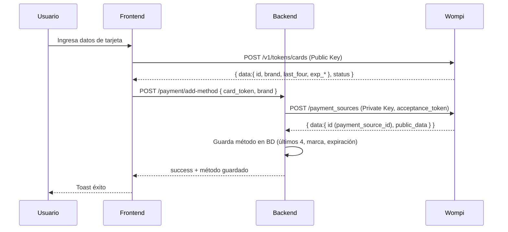
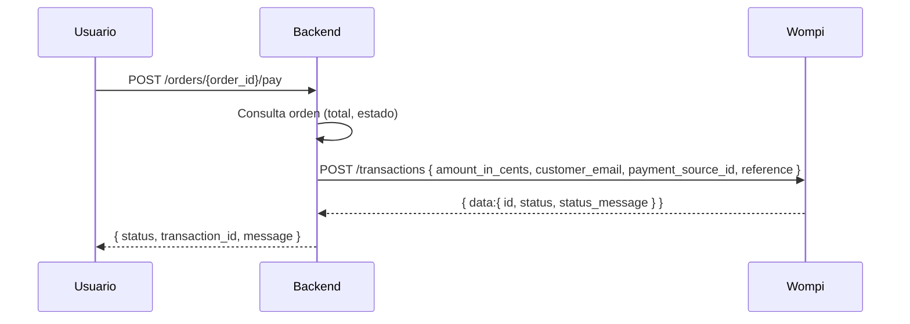
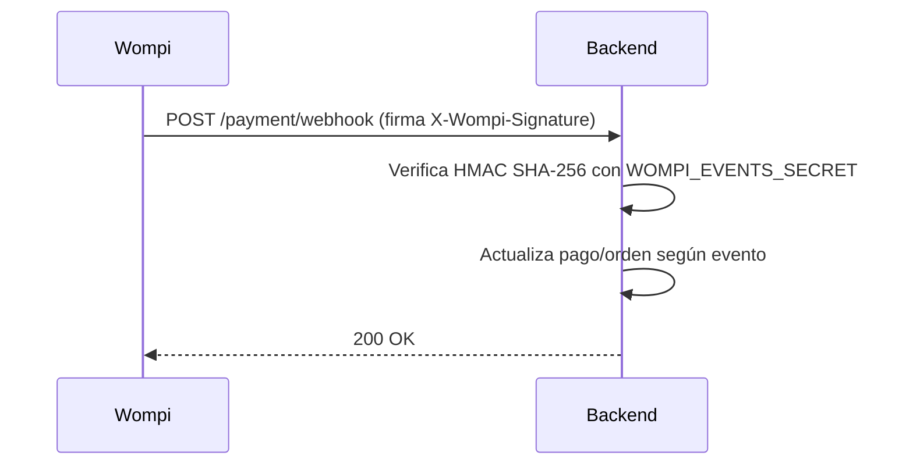

# 💳 Guía de Integración con Wompi

## 📋 Resumen

Esta guía documenta la integración completa con la pasarela de pagos Wompi en Revital: tokenización segura en el frontend, creación/gestión de métodos de pago en el backend, pago de órdenes, manejo de webhooks y consideraciones de seguridad.

## 🏗️ Arquitectura

```
┌──────────────────────────┐      ┌────────────────────┐      ┌──────────────────────┐
│         Frontend         │      │       Backend       │      │        Wompi         │
│                          │      │                    │      │                      │
│ • payment.service.ts     │◀────▶│ • payment_router   │◀────▶│ • API REST           │
│   (tokeniza tarjeta)     │      │   (métodos pago)   │      │   (tokens, sources)  │
│ • UI métodos de pago     │      │ • payment_service  │      │ • Webhooks           │
│ • axios (Wompi Public)   │      │ • wompi_service    │      │                      │
└──────────────────────────┘      └────────────────────┘      └──────────────────────┘
```

Puntos clave:
- La tarjeta se tokeniza en el frontend con la **WOMPI_PUBLIC_KEY** pública. El backend nunca recibe datos crudos de tarjeta.
- El backend crea una “fuente de pago” en Wompi con el token y guarda metadatos (últimos 4 dígitos, marca, expiración) en la BD.
- El pago de órdenes se hace creando una transacción en Wompi usando la fuente de pago guardada.
- Webhooks de Wompi confirman estados asíncronos. Se valida la firma con `WOMPI_EVENTS_SECRET`.

## 🔐 Variables de Entorno

Frontend:
- `NEXT_PUBLIC_WOMPI_PUBLIC_KEY`: llave pública para tokenizar tarjetas (sandbox/producción).

Backend (`backend/app/core/config.py`):
- `WOMPI_ENVIRONMENT`: `sandbox` o `production`.
- `WOMPI_PUBLIC_KEY`: llave pública (para usos que apliquen).
- `WOMPI_PRIVATE_KEY`: llave privada para firmar requests del servidor.
- `WOMPI_EVENTS_SECRET`: secreto para verificar firma de webhooks.

## 📁 Archivos relevantes

Frontend:
- `frontend/services/payment.service.ts`
  - `addPaymentMethod`: tokeniza tarjeta con `POST https://sandbox.wompi.co/v1/tokens/cards` usando `NEXT_PUBLIC_WOMPI_PUBLIC_KEY` y envía `{ card_token, brand }` al backend (`/payment/add-method`).
- `frontend/components/layout/shop/profile/add-payment-method-dialog.tsx`
  - Formulario (Zod + RHF) para capturar datos de tarjeta y disparar `addPaymentMethod`.
- `frontend/components/layout/shop/profile/payment-tab.tsx`
  - Lista, agrega, elimina y marca por defecto los métodos de pago (React Query + toasts).
- `frontend/types/payment/index.ts`
  - Tipos para tokenización (Wompi) y métodos de pago.

Backend:
- `backend/app/services/wompi_service.py`
  - Adaptador a API Wompi: `create_payment_source`, `get_acceptance_token`, `create_transaction`.
- `backend/app/services/payment_service.py`
  - Lógica de negocio: crea fuente en Wompi con el token, valida respuesta y persiste método en BD.
- `backend/app/routers/payment_router.py`
  - Endpoints: `POST /payment/add-method`, `GET /payment/list-methods`, `DELETE /payment/delete-method/{id}`, `PUT /payment/set-default-method/{id}`, `POST /payment/webhook`.
- `backend/app/routers/order_router.py`
  - `POST /orders/{order_id}/pay`: crea transacción en Wompi usando `provider_source_id`.
- `backend/app/schemas/payment_schema.py`
  - Schemas Pydantic para payloads y respuestas del dominio pagos/Wompi.

## 🔄 Flujos de Integración

### 1) Tokenizar y guardar un método de pago



Puntos destacados:
- El formulario de tarjeta nunca toca nuestro backend sin tokenizar.
- En el backend, se obtiene un `acceptance_token` (si aplica) y se crea la `payment_source` en Wompi.
- Se guarda solo lo necesario: `provider_source_id`, `last_four`, `brand`, `exp_month`, `exp_year`.

### 2) Pagar una orden con una tarjeta guardada



Notas:
- El endpoint de Wompi devuelve un estado inmediato; los webhooks consolidan estados asíncronos.
- `reference` debe ser único por transacción (se suele usar `order-{id}-{uuid}`).

### 3) Webhook de Wompi



Claves:
- Se valida la firma comparando el HMAC del body con el header `x-wompi-signature`.
- Actualiza estado de transacciones/órdenes (aprobada, declinada, anulada, error, etc.).

## 🧩 Explicación por archivo (cómo se hizo y qué hace)

- `frontend/services/payment.service.ts`
  - Usa `axios` para tokenizar (`/v1/tokens/cards`), revisa `WompiTokenResponse` y devuelve errores amigables de validación.
  - Envía el `card_token` y `brand` a `/payment/add-method` (nuestro backend) usando `apiWrapper`.

- `frontend/components/layout/shop/profile/add-payment-method-dialog.tsx`
  - Form controlado con Zod + RHF. Envía los campos a `onAddPaymentMethod` (la mutación). Muestra toasts.

- `frontend/components/layout/shop/profile/payment-tab.tsx`
  - Carga lista de métodos (`GET /payment/list-methods`), permite agregar, eliminar y marcar por defecto.
  - Usa React Query para invalidar caché tras mutaciones.

- `backend/app/services/wompi_service.py`
  - Centraliza llamadas a Wompi con `httpx`. Maneja headers, base URL según `WOMPI_ENVIRONMENT`, y errores HTTP.
  - `create_payment_source(email, card_token)`: crea fuente (tarjeta) en Wompi con el token.
  - `create_transaction(...)`: crea transacción para pagar una orden.
  - `get_acceptance_token()`: obtiene el token de aceptación del comercio (cuando aplica).

- `backend/app/services/payment_service.py`
  - Orquesta: llama a `wompi_service.create_payment_source`, valida respuesta y guarda en BD con `fun_agregar_metodo_pago`.
  - Expone `list_payment_methods`, `delete_payment_method`, `set_default_payment_method`.

- `backend/app/routers/payment_router.py`
  - Endpoints REST para CRUD de métodos de pago y webhook Wompi (firma HMAC verificada).

- `backend/app/routers/order_router.py`
  - Endpoint `/{order_id}/pay` que crea transacción en Wompi con `payment_source_id`.

## ⚠️ Consideraciones de Seguridad y Buenas Prácticas

- Nunca envíes datos crudos de tarjeta al backend; siempre tokeniza en el cliente con la llave pública de Wompi.
- Mantén `WOMPI_PRIVATE_KEY` y `WOMPI_EVENTS_SECRET` solo en el backend.
- Verifica firmas de webhooks y responde 200 solo si el payload es válido.
- Usa `reference` única para idempotencia de transacciones.
- Maneja estados asíncronos vía webhook para evitar inconsistencias.

## 🧪 Endpoints Wompi usados

- `POST /v1/tokens/cards` (Frontend, Public Key): tokenizar tarjeta.
- `POST /v1/payment_sources` (Backend, Private Key): crear fuente de pago.
- `POST /v1/transactions` (Backend, Private Key): crear transacción (cobro).

## 🧭 Paso a paso cronológico

1) Configuración de llaves y entorno
- Definir `NEXT_PUBLIC_WOMPI_PUBLIC_KEY` en frontend, `WOMPI_ENVIRONMENT`, `WOMPI_PRIVATE_KEY`, `WOMPI_EVENTS_SECRET` en backend.

2) Tokenización en frontend
- Implementar `payment.service.ts` para llamar a `POST /v1/tokens/cards` y manejar validaciones/errores.

3) Guardar método en backend
- Implementar `payment_router.add-method` → `payment_service.add_payment_method` → `wompi_service.create_payment_source` → guardar en BD.

4) UI para gestionar métodos
- `payment-tab.tsx` y `add-payment-method-dialog.tsx` para CRUD, reactividad y UX.

5) Pago de órdenes
- `order_router.pay_order` llama a `wompi_service.create_transaction` con `payment_source_id` y responde estado.

6) Webhooks
- Exponer `/payment/webhook`, verificar firma y actualizar estados de pago/orden.

## 🐞 Manejo de errores

- Errores de tokenización: traducidos desde `WompiTokenResponse.error` (p. ej., `card_holder`, `reason`).
- Errores HTTP Wompi (backend): convertidos a `HTTPException` con detalles.
- Consistencia: fallback en webhook para estados asíncronos; logs informativos.

---

Fecha: 2025-09-17  
Versión: 1.0.0  
Autor: Revital Development Team


